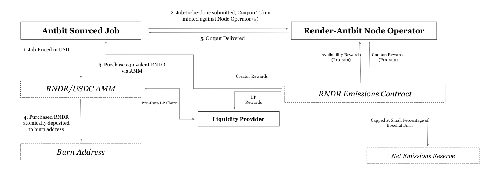

## **RNP-004: Compute Clients**

---
|RNP # |Title  |Category | Author |Created | Status |
|------|-------|---------|--------|--|--|
|004   | Compute Clients |Core |Ryan Shea and Ahmad Shadid|07-11-2023|Approved and on the Roadmap|
---

**Overview**

The Render Network has historically served users seeking a specific form
of compute: GPU accelerated, path-tracing image, and motion rendering
jobs. Render Network's initial focus has been democratizing access to
and pushing the physical boundaries of this class of media, and the
Render Network product has made this available for artists, designers,
and engineers at scale.

At the base of Render Network is a network of GPUs, which are capable of
performing massively parallel workloads across a variety of use cases
via its SDK. The network is in an extremely strong position to support
compute jobs across machine learning training, inference, and fine
tuning functions.

In order to better serve these new use cases, this RNP proposes an API
for external clients to access Render Network compute. ANTBIT.IO, a
protocol launching alongside this framework, is an alpha test case
seeking to leverage the supply side resources of the Render Network. In
combination with this implementation, the Render Network aims to enable
a decentralized accelerated computing cloud offering.

ANTBIT.IO deploys a set of proprietary and open source python
distributed compute frameworks. It will be the first client to access
and collaborate with the Render Network Foundation on bug testing and quality
assurance of the APIs to interface with nodes on the Render Network.
With a successful implementation of Open Compute Clients, the Render
Network will be able to scale complex machine learning workloads through
data parallelism, performing functions across training, inference,
fine-tuning, and reinforcement learning.

**Category**

This is a Core Proposal within the technical subcategory.

**Motivation**

Render Network is effectively a distributed marketplace for GPUs. The
advantage of GPUs is that they are massively parallelizable and can be
programmed in bespoke ways to perform accelerated computing jobs of any
variety. They are the de facto base layer infrastructure for all machine
learning, high performance computing, and rendering workflows.

Advances in machine learning specific to language and diffusion models
have massively expanded the addressable demand for GPUs (several orders
of magnitude greater than ray-tracing rendering compute). Artists and
engineers are also increasingly using Artificial Intelligence
computation for image production, both in traditional 2D/3D use cases
and for emerging immersive formats like Neural Radiance Fields (NeRFs)
and light fields. The network's SDK has been developed to provide a
platform for an increasing variety of computation processes, from GPU
accelerated path-tracing to machine learning. There are an increasing
number of highly performant GPUs on the Render Network today, each of
which is available to contribute compute resources for a variety of
tasks.

Generative model workloads magnify the inherent computational challenges
behind ML workloads. This comes along two axes:

-   Large organizations are increasingly running out of compute
    resources internally;

-   and licensing costs and restrictive onboarding requirements make
    independent Cloud farms and Cloud service providers an
    inaccessible option for many.

ANTBIT.IO delivers a set of products, clients, and libraries that allow
machine learning teams to access distributed Cloud clusters
permissionlessly (and at a small fraction of the cost of comparable
centralized services) by tapping into Render Network's increasing supply
of GPUs. This allows the Render Network to act as a horizontal compute
marketplace, with the aim of fostering a rich ecosystem of compute
intensive workloads and applications.

**Stakeholders**

This proposal impacts all members of the Render Network community.

**Implementation**

*Network Overview*

ANTBIT.IO leverages distributed computing frameworks in order to allow
machine learning engineering and operations teams to scale their
workloads across a network of GPUs with minimal adjustments. With
ANTBIT.IO, teams are able to parallelize workloads across Render Network
GPUs by spinning up on-demand cluster instances and leveraging advanced
libraries that handle orchestration, scheduling, fault tolerance, and
scaling.

ANTBIT.IO will act as a generalized compute network for parallel
processing common machine learning tasks such as data preprocessing,
distributed training, hyperparameter tuning, reinforcement learning, and
model serving. It is designed to serve general purpose computation for
Python workloads.

The ANTBIT.IO Cloud offering is purpose built for four core functions:

1.  Batch Inference and Model Serving: Performing inference on incoming
    batches of data can be parallelized by exporting the architecture
    and weights of a trained model to the shared object store.
    ANTBIT.IO allows machine learning teams to build inference and
    model serving workflows across a distributed network of GPUs.

2.  Parallel Training: CPU/GPU memory limitations and sequential
    processing workflows present a massive bottleneck when training
    models on a single device. ANTBIT.IO leverages distributed
    computing libraries in order to orchestrate and batch training
    jobs such that they can be parallelized across a number of
    distributed devices using data and model parallelism.

3.  Parallel Hyperparameter Tuning: Hyperparameter tuning experiments
    are inherently parallel, and ANTBIT.IO leverages distributed
    computing libraries with advanced Hyperparam tuning for
    checkpointing the best result, optimizing scheduling, and
    specifying search patterns simply.

4.  Reinforcement Learning: ANTBIT.IO uses an open-source library for
    reinforcement learning, which provides support for
    production-level, highly distributed RL workloads alongside a
    simple set of APIs.

*Implementation*

With a successful implementation, nodes will be able to onboard to the
Render Network and opt-in to serve as supply side compute resources by
running a lightweight external client via Docker container. Current
Render nodes will be able to specify their public key, and new nodes
will be able to generate new keys for rewards distribution. Traditional
Render Network jobs will be prioritized over general compute jobs where
possible, and node operator earnings may be less for general compute
reservation periods.

Customers are able to submit cluster booking requests directly on the
ANTBIT.IO platform. In initial phases, all requests will be denominated
in USD and paid out via stablecoin rails. The Render Network and
Foundation will not be a party to the fiat payout system before the
burn-mint-equilibrium is implemented on the Render Network.

Upon completion of the Render Network's migration to Solana, all
payments and rewards will be intermediated by Render Network's
burn-and-mint equilibrium, and nodes will be rewarded in RNDR tokens (or
[ANTBIT.IO](http://antbit.io) will switch to payout the Render Network
nodes in RNDR). Availability and compute rewards as defined in following
sections are always denominated in RNDR for all Render Network Nodes.

Nodes are able to join as long as they meet minimum hardware and
bandwidth specifications, and users will be able to spin up clusters as
per workload requirements subject to availability. Nodes are clustered
into pools based on hardware performance, internet bandwidth, peak
hours, location, supply availability, and other criteria.

*Rewards Distribution*

For jobs submitted to the network, users can select a time preference in
hours and receive a cost estimate from the ANTBIT.IO pricing oracle
based on the batching and sequencing performed by Ray \[ant-sdk
clusters\]. In each epoch, each node performs some share of the total
compute (N) performed by the network denominated in coupon tokens
(Compute Credits).

In each emissions epoch, node operators receive their share of allocated
compute rewards C_t

Where C_t corresponds to a portion of RNDR emissions in a given epoch,
dollar weighted against Octane rendering workloads occurring in parallel
on the network.

ANTBIT.IO will submit small test jobs at random times in order to assess
which nodes are regularly live and well positioned to accept jobs from
the demand side. Each job will assess internet bandwidth (b), memory
(m), cpu clock speed (c), and terraflop readings (t).

For each given test, an availability performance score (P) is calculated
for each node operator

As node operators perform availability challenges and compute jobs sent
over the network, a cumulative score of their performance is calculated
as a measure of reputation. Node operators with high reputation scores
receive preferential treatment for jobs submitted to the network, and
bonus rewards at various points in the network.

Over time, ANTBIT.io will institute bespoke bonus multipliers for nodes
with high performance and availability.

*Pricing and Tiers*

Compute pricing is inherently variable. ANTBIT.IO will aim to offer
clusters at a floating discount to market rates, subject to surges and
industry-wide benchmark advances.

A rough approximation of expected earnings for miners is provided below.
Note that dollar denominated payout breakeven estimates will differ from
token denominated breakeven estimates.

ANTBIT.IO services are priced on a multivariate model including hardware
performance (tensor cores, GPU bandwidth, VRAM, TFLOPS, GPU model, CPU
model, CPU clock speed, CPU cores, RAM, disk SSD/HDD), internet
bandwidth, peak hours, location, supply availability, and more. Clusters
are priced as per the individual units of GPU supply booked for a given
period of time. As increasing amounts of supply onboard to the network,
pricing will be tiered based on availability, hardware specifications,
bandwidth, and geography. Render Network nodes will need to opt-in to
supply this information through Antbit's client.

