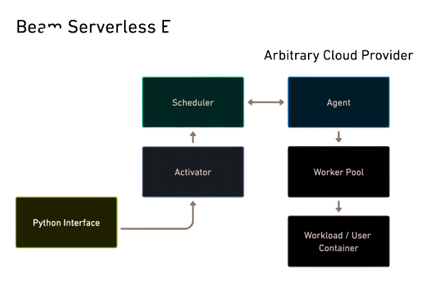
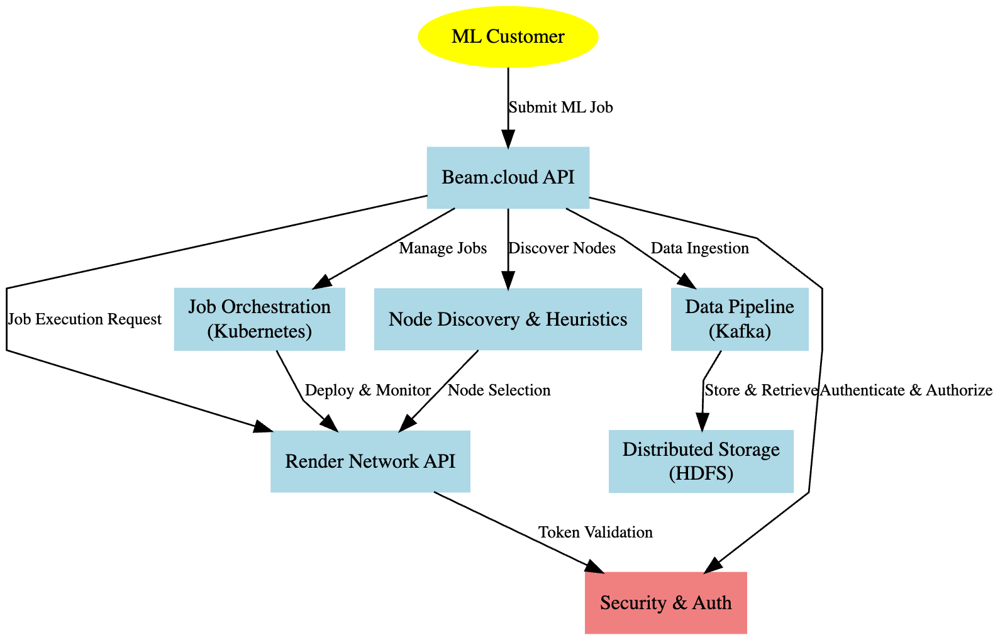

## **RNP-005: Beam Compute Client**

---
|RNP # |Title  |Category | Author |Created | Status |
|------|-------|---------|--------|--|--|
|005   |Beam Compute Client |Core |Ryan Shea and Eli Mernit|10-23-2023|In Render Team Review|
---

## Overview

This proposal outlines onboarding
[Beam](https://www.beam.cloud/) as the second Compute
Client to leverage Render Network\'s GPU supply for machine learning
workloads.

Beam provides a cloud platform to accelerate AI development and
deployment using GPUs without managing infrastructure. Key capabilities
include:

1.  Local Python development with remote execution on cloud GPUs

2.  Dynamic cluster orchestration by specifying GPU types/counts, libraries

3.  Auto-scaling of GPU instances based on workload demand

4.  Serverless deployment via REST APIs, cron jobs, task queues

5.  Distributed storage volumes attached to containers

6.  SDKs for CI/CD integration and tooling

Integrating Beam enables the Render Network\'s decentralized GPU network
to power these ML-focused workloads. Beam clusters will be able to
access the Render Network's global supply of GPUs tailored for
parallelized AI computations.\
\
Progressing to a multi-tenant marketplace broadens the Render Network's
utility as a horizontal provider of decentralized GPU capacity. Beam\'s
specialization in machine learning complements existing clients by
bringing in new demand for model serving, distributed training, and
hyperparameter tuning.

## Category

This is a Core Proposal within the technical subcategory.

## Motivation

RNP-004 outlined io.net (fka ANTBIT) as the first Compute Client on
Render Network, and has demonstrated the value of opening Render
Network\'s GPU capacity to machine learning workloads. There remain
opportunities to expand the set of workloads that can be serviced by the
network. At present, io.net excels at distributed training and inference
by coordinating workloads across provisioned clusters, making it ideal
for teams needing to scale experiments. However, io.net requires more
dev-ops overhead to configure infrastructure.

Beam offers a complementary approach tailored for engineers and
researchers focused on rapid prototyping and deployment. Beam abstracts
away infrastructure management by automatically handling cluster
orchestration, autoscaling, load balancing and more. Users can go from
local development to remote GPU execution in minutes.

For example, with io.net users must define cluster specifications and
individually register nodes to orchestrate distributed jobs. Beam allows
dynamically spinning up auto-scaled clusters by simply specifying
hardware requirements in Python. io.net relies on bringing your own
storage like S3, while Beam provisions high-speed volumes attached
directly to containers.

These differences result in io.net excelling for tailored large-scale
distributed workloads, while Beam simplifies the path to implementing
GPUs for common AI tasks. io.net gives more granular control, while Beam
offers higher-level abstractions.

Supporting both approaches expands Render Network\'s accessibility to
new users and use cases within machine learning. Teams can leverage the
network's on-demand GPU capacity based on their specific needs, from
early prototyping to large-scale production.

Onboarding an additional client like Beam demonstrates progress toward
serving multiple types of compute workloads, and enhances redundancy and
flexibility. This diversity strengthens Render Network\'s evolution into
a horizontal provider of decentralized GPU infrastructure. Specialized
providers like Beam, io.net, and subsequent Compute Clients, drive
utilization by unlocking emerging workloads in AI and machine learning.

RNP-005 would provide the first prototype example for Compute Client
partners to leverage the Render Network's on-demand GPU capacity
expanding the network to serve a wider range of general purpose AI / ML
compute applications.

## Stakeholders

This proposal impacts all members of the Render Network community.

## Implementation

Integrating Beam as a new Compute Client leverages much of the
groundwork established for prior clients like io.net, while requiring
tailored optimizations to support Beam\'s unique capabilities and
architecture. We propose that an independent working group is granted
56.5K RNDR tokens (\$100K) on a milestone basis to drive the development
of the initiatives.

The Beam-Render Working Group (BRWG) is expected to build infrastructure
to accomplish the following, with percentage amounts of the total grant
unlocking at completion of each individual milestone:

### **API Integration (10%)**

- Establish a secure connection between Beam.cloud and Render Network\'s API.

- Implement authentication mechanisms to ensure only authorized Beam.cloud instances can submit jobs to Render Network.

### **Job Submission and Orchestration (10%)**

- Modify Beam\'s job submission interface to include options specific to Render Network, such as selecting specific GPU types or specifying node reputation thresholds.

- Implement a job scheduler in Beam that can break down large ML tasks into smaller chunks suitable for distribution across the Render Network.

### **Client Container (10%)**

- Beam will install an agent on participating Render Network nodes. This registers the node as available GPU capacity in Beam\'s cluster management layer.

- The Beam agent handles orchestration commands from the central Beam
  platform to manage job execution based on user requests.

### **Cluster Orchestration (20%)**

- For each user job, the Beam cluster manager will select an optimal set of RNDR nodes to provision a GPU cluster on-demand. It considers factors like node locality, reputation, and hardware specs.

- Beam will dynamically scale up or down the number of cluster nodes according to the parallelization specified by the user job configuration and overall demand.

- Optimal nodes may be determined based on GPU types, availability of peer nodes, storage volume capacity, and proximity to the job\'s datasets.

### **Node Discovery (10%)**

- The Beam container will identify and report node hardware capabilities such as GPU models, memory, cores, storage availability, and network specs.

- This allows Beam\'s cluster manager to match job requirements to suitable nodes when orchestrating provisioning. The container regularly reports refreshed specs.

### **Storage Volumes (10%)**

- For distributed training jobs, Beam can directly attach high-speed storage volumes to each cluster container. This enables low-latency shared access to large datasets.

- Volumes are provisioned from Beam\'s networked filesystem and locally mounted by the containers at runtime based on job configurations.

- After job completion, the volumes can be unmounted and reattached seamlessly to new containers for subsequent jobs as needed.

### **Usage Metering (10%)**

- Beam will meter the consumption of GPU and other resources for each job and node. This data feeds into the reputation system and is used for Beam\'s billing of users.

- Metered usage will also determine proportional \$RNDR token rewards for nodes, aligned with Render Network\'s decentralized settlement model.

- Metering data can also help optimize scheduling and resource allocation for future jobs.

### **Reputation System (10%)**

- Key metrics like job completion rates, performance, uptime, and responsiveness will contribute to per-node reputation scores.

- Higher reputation nodes will be prioritized for provisioning and can qualify for bonuses. Poorly performing nodes may be avoided during scheduling.

- This incentivizes reliable capacity and quality of service across Render Network\'s decentralized ecosystem.

This proposal defines a pilot technical implementation, following which
a payout and billing structure will be specified. At steady state, all
payouts to Render nodes that perform Beam workloads will be
intermediated by Render Network i.e. nodes will be rewarded in RNDR
tokens as per the burn-and-mint equilibrium model. Availability and
compute rewards will be distributed as per the specification in RNP-004.

## Technical Considerations

A high-level architecture is proposed below:

By tailoring the implementation to support Beam\'s unique workflows and
architecture, Render Network can expand its capabilities as a Compute
Client platform supporting diverse emerging workloads powered by GPUs.\
\

## Drawbacks

- **Node Fragmentation** - Operating multiple client workloads simultaneously on nodes could produce inefficiencies in GPU utilization if not balanced well. Intelligent job arbitration and scheduling will be important.

- **Reputation Silos** - Independent reputation scores segmented by client may be disjointed. A cross-client reputation framework could improve consistency.

- **Billing Complexity** - Settlement and revenue share between \$RNDR tokens and native platform currencies could add financial complexity depending on model.
