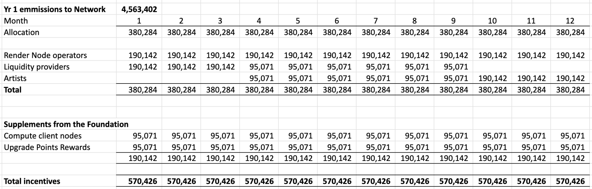
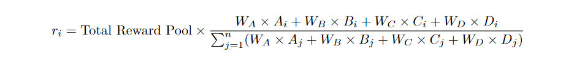
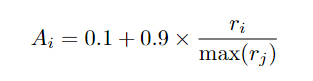
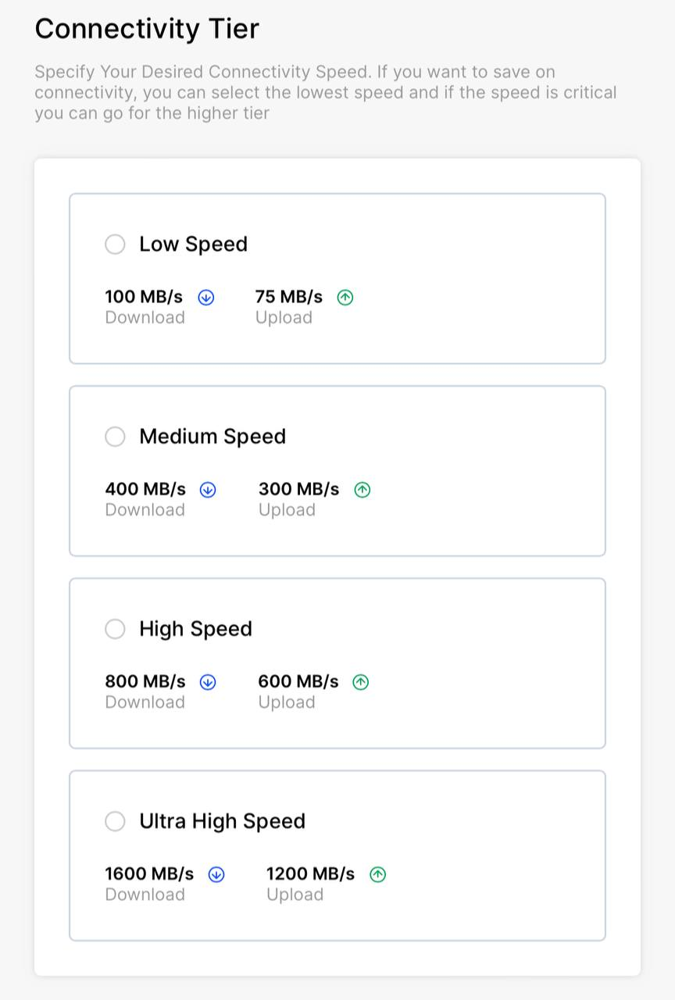
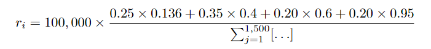

## **RNP-006: Solana Upgrade and Emission Schedule**

---

| RNP # | Title                                | Category | Author | Created    | Status                |
| ----- | ------------------------------------ | -------- | ------ | ---------- | --------------------- |
| 006   | Solana Upgrade and Emission Schedule | Core     |        | 11-02-2023 | Approved + Roadmap|

---

## Overview

This document outlines the transition process from RNDR to RENDER tokens, the
Burn Mint Equilibrium (BME) model, and the associated emissions and rewards
structure on the Render Network.

The following Render Network Proposal (RNP) is in support of the implementation
of [RNP-001](https://github.com/rendernetwork/RNPs/blob/main/RNP-001.md) and
[RNP-002](https://github.com/rendernetwork/RNPs/blob/main/RNP-002.md). The
Render Network (the “Network”) will undergo an upgrade with the adoption of
‘RENDER’, a Solana-based SPL token implementing the Burn Mint Equilibrium
(“BME”) described below.

## Category

This is a Core Proposal within the Technical subcategory.

## Motivation

The new Solana-based token helps the network support a wider range of
applications and services leveraging the low cost, high throughput transaction
infrastructure of the Solana blockchain.

This Proposal lays out the proposed features of the upgrade process to the
Solana blockchain.

## Stakeholders

This proposal impacts all members of the Render Network community.

## Implementation

### **Upgrading**

The following upgrade assistant—located at
[upgrade.rendernetwork.com](http://upgrade.rendernetwork.com)—exists to enable
the permissionless upgrade of RNDR tokens to RENDER tokens.

This upgrade assistant is live, and upon approval of RNP-006, the community will
formally approve and adopt the launch and upgrade to the RENDER token. Token
holders can upgrade RNDR to RENDER whenever they would like.

The Render Foundation has allocated up to 1.14 million RNDR in grants over the
first year of emissions to subsidize user transfer fees on Ethereum associated
with the upgrade. The upgrade assistant program will be in effect for three
months, and will pay for gas fees for one transfer per Render wallet. After
three months, holders will have to pay their own gas fees to migrate RNDR tokens
to the Solana blockchain.

With its broad circulation and liquidity, there is an ongoing role for the RNDR
token, at least in the short to mid term, while its relative total supply and
liquidity exceeds that of RENDER.

We expect that RNDR holders will migrate to RENDER, as there are certain
incentives to upgrading. For instance:

- Reimbursement of gas fees for using the upgrade assistant
- RENDER incentives to those who upgrade, weighted in favour of early adopters
  as listed in the table below.
- Liquidity rewards are available for RENDER token holders. 

### **Gas and Upgrade Fees**

In order to incentivize upgrading to RENDER, The Render Network Foundation will
cover the price of one (1) upgrade from the Ethereum network to the Solana
network. Beyond this initial upgrade, and after three months, users will have to
pay for fees on their own.

Each RNDR wallet, captured as of November 15, 2023, will be eligible for one (1)
costless transaction to upgrade their RNDR token to RENDER. Wallets migrating
with recent transfers off of exchanges can also be eligible. More information
regarding unique fee reimbursements will be provided soon.

### **RENDER and BME Emissions**

Emissions on the Network will be in the form of RENDER tokens.

RENDER paid to the Network by artists and Compute Clients (or their third-party
providers) will be burned by the Network after deducting a 5% transaction fee.
For a transitional period, artists and Compute Clients will continue to be able
to pay the Network in RNDR instead of RENDER, and this RNDR will also be burned
by the Network.

As a result, the token supply of the Network should be viewed, in the aggregate,
as the sum of all RENDER tokens (see section “Initial Emissions Splits” below)
and those RNDR tokens that have not yet been upgraded (see section “Upgrading”
above).

### **Rewards**

Token holders who upgrade to the RENDER token will be grouped in increments.
Future protocol benefits and rewards will be graduated based on these groups.

**Total Cumulative Tokens Upgrading**
| **From**    | **To**      | **Points** |
| ----------- | ----------- | ---------- |
| 1           | 39,999,999  | 5          |
| 40,000,000  | 79,999,999  | 4          |
| 80,000,000  | 139,999,999 | 3          |
| 140,000,00  | 179,999,999 | 2          |
| 180,000,000 | 229,999,999 | 1          |
| 230,000,000 | onwards     | 0          |

For each RNDR token upgraded at a given time, a specific allocation of points
will be distributed to the address holder. No points are allocated for tokens
migrated after the 229,999,999th token. In monthly intervals RENDER tokens will
be distributed pro rata, based on the points allocated to a wallet as a
proportion of total points allocated to date.

_Example:_ If 10,000,000 RNDR have been upgraded in month one, a wallet holder
of 100,000 RENDER will receive 100,000 x 5 points = 500,000 points. 500,000
points divided by 50 million total points x 95,071 RENDER = 950.71 RENDER paid
to that wallet at the end of month one. In month two, when more RNDR have been
upgraded, the total points allocated will be higher and this wallet will receive
a smaller proportion, and so on. This will go on for 12 months.

**_Note for clarity:_** the Foundation will upgrade RNDR to RENDER in order to
fund upgrade incentives until the BME model is launched, and will opt out of incentives.

### **Initial Emissions Splits**

Once the BME model has been deployed, the initial application of emissions will
be as follows:

1.  A total of 9,126,804 RENDER tokens will be minted on the Network,
    representing the full first year Emissions referenced in RNP-001.
2.  This equates to 760,567 RENDER per month. Under RNP-003, 50% (380,284
    RENDER) goes to the Network and 50% goes to the Render Foundation.
3.  Node operators start with an allocation of 50% of monthly Network Emissions
    (190,142 RENDER tokens).
4.  For the first 3 months, the remaining 190,141 monthly Network Emissions will
    be allocated to a Liquidity rewards pool. Thereafter, for the next 6 months
    this will be split so that 50% of this remainder (95,707 RENDER) will be
    allocated to the Liquidity rewards pool and 50% (95,707 RENDER) towards an
    Artists’ rewards pool. After that (9 months from BME deployment) all
    remaining Emissions will be distributed to the Artists rewards pool.
5.  A maximum of 1.14M RNDR tokens (25% of year 1 Foundation emissions) are
    allocated in year 1 for Compute Client onboarding incentives. A minimum of
    300K tokens from the Foundation are allocated as onboarding incentives for
    new consumer GPU Render nodes via the io.net Compute Client.
6.  A maximum of 1.14M RNDR tokens (25% of year 1 Foundation emissions) are
    allocated in year 1 for points-based incentives.

The BME model will go live in the next few weeks, with a final date to be
communicated within relevant social channels.

Voting yes on this proposal will mean recognition of this split as the canonical
emissions schedule for the RENDER token and the RENDER holding community. In
addition, voting yes will also confirm the desire to repay any amounts due to
OTOY Inc. under the 4.5M RNDR loan facility as set forth in RNP-004.

### Compute Client Rewards Mechanism

**Qualifying Nodes**

Onboarded Nodes that meet a minimum threshold of performance and bandwidth will
qualify for rewards in a given Epoch.

To qualify the Nodes, GPUs need to:

1.  Be on the approved list of GPU models in section 6 below,

2.  Have onboarded via
    [www.renderfoundation.com/waitlist/](http://www.renderfoundation.com/waitlist/)
    which specifically includes providing the Render Network with a valid Solana
    wallet for Reward deposit,

3.  Be live on a Compute Client within the cohort, for example having
    successfully installed io.net's client and connected it, and for io.net
    having correctly identified yourself as a Render Network Node, and

4.  Operate with an average download bandwidth speed of greater than 100Mbps per
    second and upload speed of greater than 75Mbps.

Please note all 4 requirements need to be met for a Node to qualify for rewards.

**Rewards Pool**

A total of 1,140,852 RENDER has been reserved for allocation as Compute Client
Rewards.

For November and December 2023, rewards will be exclusively earned by Nodes
available on io.net, thereafter all Qualifying Nodes will be eligible to
participate.

The initial Epochs and Reward pools will be as follows:

-   00:00 GMT Monday, November 201 - 23:59 Thursday, November 30 - **100K
    RENDER**

-   00:00 GMT Friday, December 1 -23:59 Sunday December 31 - **200K RENDER**

From 1/1/24, Compute Client rewards will continue on monthly Epochs until
10/31/24.

The Reward Pool for these monthly Epochs will be calculated as the total
remaining Rewards divided by the number of months left up to 10/31/24.

By way of example, should 840,852 Rewards remain unallocated as of 1/1/24, the
January Rewards pool would be 840,852 divided by 10, for a total of 84,085.2
RENDER.

Note, to avoid edge cases, the available rewards per Epoch will be the lower of
the above Rewards, and the product of the number of Qualified Nodes available
during the Epoch and 75 RENDER.

By way of example if there are 1,000 qualified nodes in the November Epoch, the
Rewards pool would be limited to 75,000 RENDER.

For the initial November and December Epoch's, io.net may request that any
unallocated rewards for an epoch be applied to run paid test jobs on io.net to
further test and improve the joint offering.

**Factors for Reward Calculation:**

For a given node *i*, the score is calculated over the following epochs and with
the following set of tokens:

-   A (Quantity of Compute - FE): USD earned running Node

-   B (Bandwidth - BW): Data upload and download capability of the node, in
    Mbps.

-   C (GPU Model - GM): Score indicating GPU\'s performance level.

-   D (Uptime - UT): Ratio of active time to total possible active time in
    Epoch.

**Weight Assignments**

Specified weights for each factor:

-   Weight for A (FE): W_A = 0.25

-   Weight for B (BW): W_B = 0.35

-   Weight for C (GM): W_C = 0.20

-   Weight for D (UT): W_D = 0.20

**Formula**

The formula for calculating the reward for a node *i* is:

**Share of Compute Work Completed**

This will be calculated as a ratio of the total amount earned running the node
compared to the earnings by all nodes over the given epoch.

The formula for calculating A~i~ is given by:

where r~i~ is the calculated reward for node i, and r~j~ represents the set of
all calculated rewards.

The term r~i~ / max(r~j~) is a normalization step. It scales the individual
reward r~i~ based on the range of all calculated rewards. The numerator r~i~ is
the relative position within the range of rewards, and the denominator max(r~j~)
is the maximum reward among all nodes and normalizes this position to a scale of
0 to 1.

Multiplying this normalized value by 0.9 and adding 0.1 shifts the range to
start from 0.1 instead of 0, providing a floor value. A~i~ therefore spans the
range \[0.1, 1\].

This choice of normalization allows A~i~ to represent the relative standing of a
node's reward within the overall distribution, making the metric comparable.

**Bandwidth Scoring System**

The following bands will be used to classify Nodes:

Should a node, on average during the epoch, exceed both the minimum download and
upload requirements for a tier, it will achieve classification within that tier.

Tier Score

Low speed 0.2

Medium speed 0.4

High speed 0.6

Ultra high speed 0.8

**GPU Model Scoring System**

|      GPU Model      | Performance Class | Score |
|:-------------------:|:-----------------:|:-----:|
| NVIDIA RTX 4090     | High-End          | 1.0   |
| NVIDIA RTX 4080     | High-End          | 0.9   |
| NVIDIA RTX 4070 Ti  | Mid-Range         | 0.8   |
| NVIDIA RTX 4070     | Mid-Range         | 0.8   |
| NVIDIA RTX 4060 Ti  | Entry-Level       | 0.7   |
| NVIDIA RTX 4060     | Entry-Level       | 0.7   |
| NVIDIA RTX 3090 Ti  | High-End          | 0.9   |
| NVIDIA RTX 3090     | High-End          | 0.9   |
| NVIDIA RTX 3080 Ti  | High-End          | 0.8   |
| NVIDIA RTX 3080-12G | High-End          | 0.8   |
| NVIDIA RTX 3080     | High-End          | 0.8   |
| NVIDIA RTX 3070 Ti  | Mid-Range         | 0.7   |
| NVIDIA RTX 3070     | Mid-Range         | 0.7   |
| NVIDIA RTX 3060 Ti  | Entry-Level       | 0.6   |
| NVIDIA RTX 3060     | Entry-Level       | 0.6   |
| NVIDIA RTX 3060M    | Entry-Level       | 0.6   |
| NVIDIA RTX 3050     | Entry-Level       | 0.5   |

**Uptime**

Uptime will be measured as the ratio of active time to total possible active
time in Epoch. This will factor in partial periods, so a Node joining half way
through the Epoch and achieving 100% uptime, would be scored at 50% uptime for
the Epoch.

**Example Scenario**

-   Network Size (n): 1,500 nodes.

-   Total Reward Pool for the epoch (November): 100,000 RENDER tokens.

-   Total earnings in USD for the epoch (November): \$125k

-   Maximum reward among all nodes max(r~j~): \$2,500

-   Weights: W_A = 0.25, W_B = 0.35, W_C = 0.20, W_D = 0.20.

**Node i Characteristics**

-   A (FE): \$100 earned by the node

-   B (Bandwidth): Medium speed (score 0.4).

-   C (GPU Model): Entry level RTX 3060 GPU (score 0.6).

-   D (Uptime): 95% (score 0.95).

**Reward Calculation for Node**

Share of compute work A~i~ = 0.1 + 0.9 × (100) / (2500) = 0.136

**Distribution and Communication**

The Render Network will facilitate payments and will make best efforts to do so
during the epoch following the current epoch.

The Render Network will be responsible for communication, including how to
qualify, Rewards earned, and Rewards support.

**Compute Client Requirements**

Compute Clients will integrate with the Render Network via its APIs.

Compute Clients will provide second level Rewards support and are responsible
for all technical support.

### **Conclusion**

The upgrade to an SPL token like RENDER promises to help the Network support a
wider range of applications and services leveraging the low cost, high
throughput transaction infrastructure of the Solana blockchain alongside
simplified payment gateways.

The chain upgrade to an SPL token should reduce the barriers to deploying
important functions, like real time payments and automated emissions in the Burn
Mint Equilibrium (BME). As part of an expanding network ecosystem, the SPL token
can simplify microtransactions for new forms of AI / ML computing, tokenized GPU
streaming, large scale NFT minting, and finally, the transition of network data
on-chain - enabling deeper levels of provenance and authentication for media
produced on the Render Network.

The SPL token fits within the upgrade of the Network from specialized 3D
rendering tasks to a broader range of interconnected computing workloads
supporting the demands of a new age of Artificial Intelligence (AI) and Spatial
Computing.
