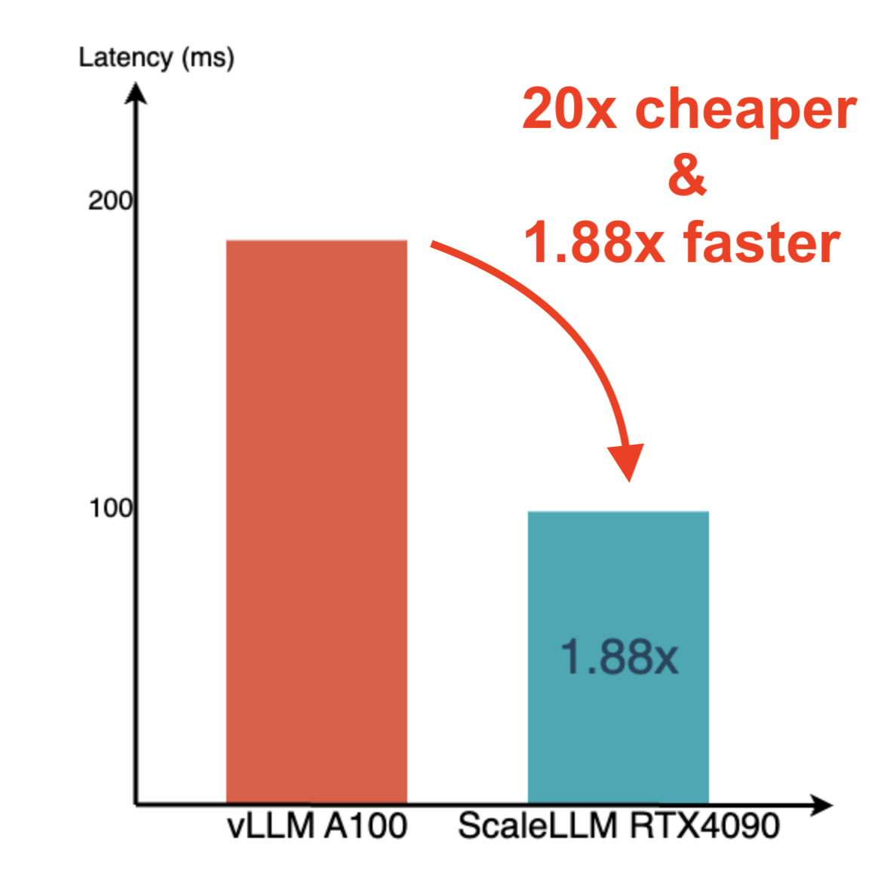
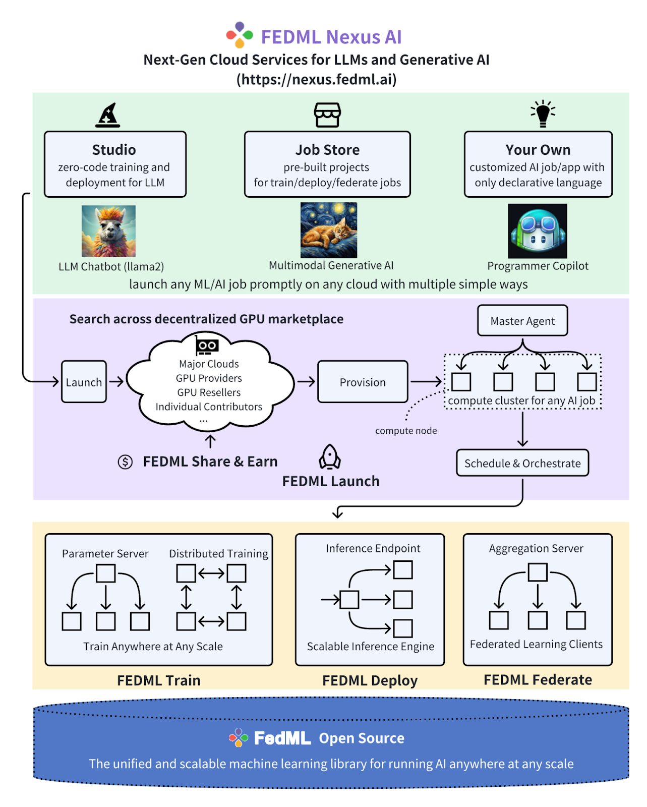
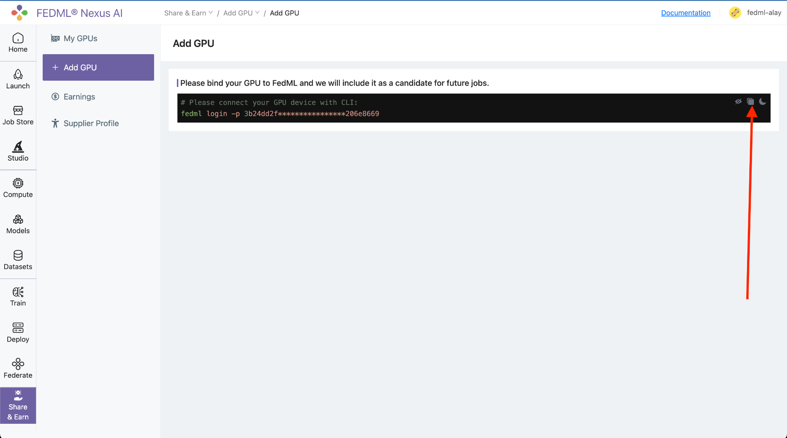
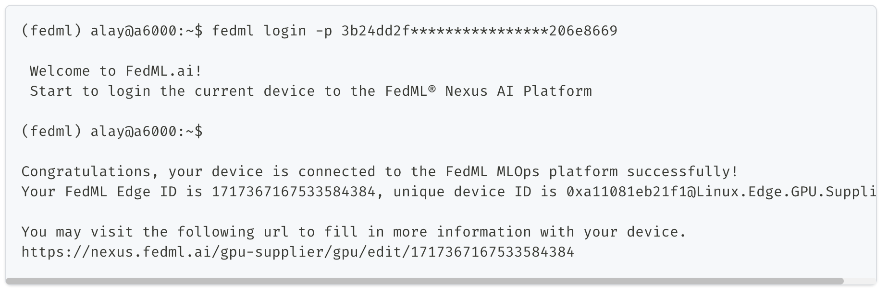
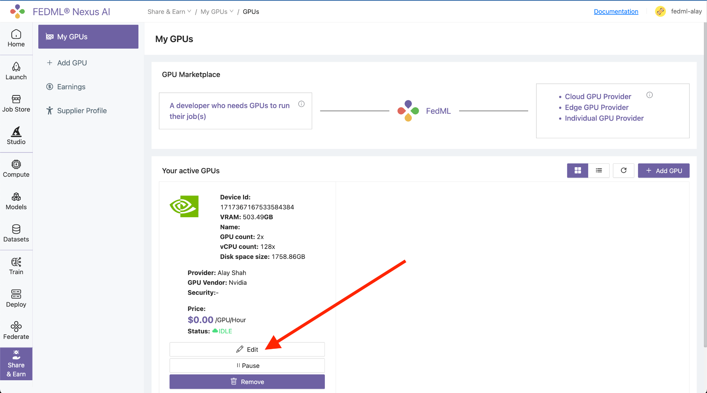
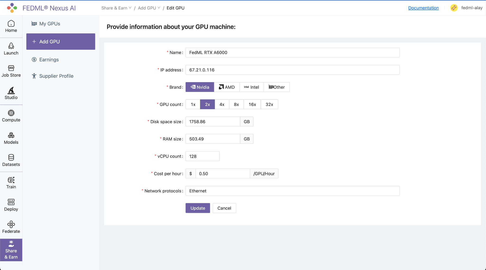

## **RNP-007: FEDML Compute Client**

---

| RNP # | Title                | Category | Author            | Created    | Status          |
| ----- | -------------------- | -------- | ----------------- | ---------- | --------------- |
| 007   | FedML Compute Client | Core     | Salman Avestimehr | 11-13-2023 | Open for Voting |

---

**Overview**

FEDML (https://www.fedml.ai) is a next-generation cloud platform that enables developers and enterprises to easily, economically, and securely build, deploy, and monetize their large language models (LLMs) and other generative AI applications. It provides holistic support with high-performance model training and deployment libraries, user-friendly LLMOps and generic MLOps, and a large-scale GPU marketplace.

FEDML can serve as a bridge between the AI community and Render\'s distributed
GPU network. Collaboration between FEDML and Render creates two significant
opportunities:

1.  **Bringing AI community demand to Render\'s compute network:** FEDML\'s GPU
    marketplace can include Render, enabling AI developers to seamlessly access
    Render\'s powerful distributed GPU resources. This integration streamlines
    workflows, reduces development time, and accelerates AI projects.

2.  **Empowering AI community:** FEDML\'s community of researchers and data
    scientists, focused on advancing decentralized and trustworthy machine
    learning, gains access to Render\'s distributed GPU network. This empowers
    them to develop and scale real-world generative AI applications, such as
    secure crowdsourced LLM training and serving.

**Motivation**

The rapid advancement of large language models (LLMs) and generative AI has
ignited an unprecedented demand for compute resources, particularly GPUs,
worldwide. These sophisticated AI models, capable of generating human-quality
text, translating languages, and creating art, require immense computational
power for training and deployment. This surge in demand has led to a global
scramble for powerful GPUs, resulting in increased prices, shortages, and
significant investments in GPU infrastructure by cloud providers. The impact
extends beyond cloud computing, as researchers and developers face similar GPU
shortages, hindering their ability to advance the state of the art.

Render Network\'s globally distributed infrastructure of heterogeneous nodes is
ideally suited to power gen-AI application development. Render can provide
on-demand access to the specialized, massively parallel processing GPUs required
to train modern deep learning models at scale. However, the current AI software
stack and platforms can't handle scalable deployment of compute and
bandwidth-intensive generative AI tasks (e.g., large model training, model
serving, etc) across geo-distributed GPU clouds.

FEDML Nexus AI platform (https://nexus.fedml.ai/) bridges this gap by innovation
across five interconnected layers:

- **GPU Marketplace for AI Development:** Addressing the current dearth of
  compute nodes/GPUs arising due to the skyrocketing demand for AI models in
  enterprise applications, FEDML Nexus AI offers a GPU marketplace that allows
  GPU providers to join effortlessly via its \"Share and Earn\" interface.

- **Unified ML Job Scheduler and GPU Manager:** With a simple fedml launch
  your_job.yaml command, developers can instantly launch AI jobs (training,
  deployment, federated learning) on the most cost-effective GPU resources,
  without the need for tedious resource provisioning, environment setup and
  management. FEDML Launch supports any computing-intensive job for LLMs and
  generative AI, including large-scale distributed training,
  serverless/dedicated deployment endpoints, and large-scale similarity search
  in vector DB. It also enables cluster management and deployment of ML jobs
  on-premises, private, and hybrid clouds.

- **Zero-code LLM Studio:** As enterprises increasingly seek to create private,
  bespoke, and vertically tailored LLMs, FEDML Nexus AI Studio empowers any
  developer to train, fine-tune, and deploy generative AI models code-free. This
  Studio allows companies to seamlessly create specialized LLMs with their
  proprietary data in a secure and cost-effective manner.

- **Optimized MLOps and Compute Libraries for Diverse AI Jobs:** Catering to
  advanced ML developers, FEDML Nexus AI provides powerful MLOps platforms for
  distributed model training, scalable model serving, and edge-based federated
  learning. FEDML Train offers robust distributed model training with advanced
  resource optimization and observability. FEDML Deploy provides MLOps for
  swift, auto-scaled model serving, with endpoints on decentralized cloud or
  on-premises. FEDML Federate extends model training and serving to edge servers
  and smartphones, enhancing privacy compliance and optimizing costs. For
  developers looking for quick solutions, FEDML Nexus AI\'s Job Store houses
  pre-packaged compute libraries for diverse AI jobs, from training to serving
  to federated training.

- **Advanced Security and Privacy:** FEDML provides four key capabilities to
  empower secure and privacy-preserving distributed machine learning: (1)
  **Trusted Execution Environments (TEEs)**, which are secure areas in
  processors that protect sensitive code and data by isolating them from the
  main operating system. This isolation protects against software and hardware
  attacks, even in untrusted environments, making it ideal for handling critical
  data and cryptographic operations; (2) **Homomorphic Encryption (HE)**, which
  allows computation on encrypted data, generating an encrypted result that,
  when decrypted, matches the result of the same operations performed on the
  plaintext (non-encrypted) data. This enables complex data processing in an
  encrypted domain, ensuring that sensitive data remains secure even during
  analysis. HE is a powerful tool for preserving privacy in cloud computing,
  data analysis, and beyond; (3) **Secure Multi-Party Computation (SMPC)**,
  which is a cryptographic protocol that allows compute nodes to jointly compute
  a function over their inputs while keeping those inputs private. The compute
  nodes only learn the output of the function, not any of the input data,
  enabling collaborative computation without compromising the confidentiality of
  the individual data sets; and (4) **Federated Learning (FL)** with secure
  aggregation and differential privacy, which is a machine learning technique
  that allows multiple nodes to train a shared model without sharing their
  individual data. This is done by having each bide train a local model on its
  own private data, and then sending the aggregated updates to a central server.
  The server then aggregates the updates and uses them to update the global
  model.

FEDML has the vision to democratize AI infrastructure by enabling
enterprise-grade scalable AI development over consumer-grade GPUs. To that end,
FEDML has recently announced
[[ScaleLLM]](https://blog.fedml.ai/scalellm-unlocking-llama2-13b-llm-inference-on-consumer-gpu-rtx-4090-powered-by-fedml-nexus-ai/),
a serverless and memory-efficient model serving engine for large language models
(LLMs) that achieves the following key milestones:

1.  Host LLaMA-2-13B-chat on a single RTX 4090 with 1.88x lower latency compared
    to vLLM on A100.

2.  Triple the efficiency by hosting three LLaMA-2-13B-chat services on a single
    A100, with 1.21x lower latency than a single vLLM service.

3.  Ultra-fast response times for LLaMA-2-13B-chat on L4/T4 GPUs, meeting the
    demand for sub-1-second first token generation.

> 

Thanks to the technical advancements brought by ScaleLLM, deploying and running
LLMs, such as LlaMA2-13B, on a blockchain GPU network has become a reality. Now
the intersection of AI and blockchain is not just a concept. It signifies a
transformative approach to AI model deployment, where developers can seamlessly
deploy AI models using a decentralized network of consumer GPUs.

Onboarding FedML opens up great opportunities for Render\'s community and AI
community. By incorporating Render into FEDML\'s GPU marketplace, AI developers
are offered a new avenue to tap into an extensive array of distributed GPU
resources. This integration is designed to optimize the AI development process,
allowing for more efficient use of computing power and reducing the overall time
from conception to deployment. It is not just about enhancing computational
capacity; this move stands to refine the entire workflow for AI practitioners.
With easier access to Render\'s powerful network, developers can rapidly scale
their projects, tackle more complex problems, and accelerate the pace of
innovation within the AI community. This partnership could effectively
streamline the bridge between the design of sophisticated AI models and their
execution on a robust GPU infrastructure.

Furthermore, this synergy between FEDML and Render extends substantial benefits
to the broader AI research community, particularly those devoted to pioneering
decentralized and trustworthy machine learning solutions. As FEDML brings
together researchers and data scientists with a common goal, Render\'s
distributed GPUs could become the powerhouse behind their ambitious projects.
This access can greatly facilitate the development of cutting-edge generative AI
applications, including those requiring secure, crowdsourced data for large
language model (LLM) training and serving. The ability to leverage such a
network means that the AI community is better equipped to address intricate
challenges, ensuring that machine learning models are not only powerful but also
developed within a framework that prioritizes decentralization and reliability.
This empowerment can lead to an era where the AI community is able to innovate
with greater freedom and reduced constraints, pushing the boundaries of what\'s
possible in generative AI.

**_FEDML Nexus AI Platform Architecture_**

Highly integrated with FEDML open source library
[[https://github.com/FedML-AI/FedML]](https://github.com/FedML-AI/FedML),
FEDML Nexus AI provides holistic support of three interconnected AI
infrastructure layers: user-friendly MLOps, a well-managed scheduler, and
high-performance ML libraries for running any AI jobs across GPU Clouds.

A typical workflow is shown in figure above. When a developer wants to run a
pre-built job in Studio or Job Store, FEDMLLaunch swiftly pairs AI jobs with the
most economical GPU resources, auto-provisions, and effortlessly runs the job,
eliminating complex environment setup and management. When running the job,
FEDML Launch orchestrates the compute plane in different cluster topologies and
configurations so that any complex AI jobs are enabled, regardless of being
model training, deployment, or even federated learning. FEDML Open Source is a
unified and scalable machine learning library for running these AI jobs anywhere
at any scale.

In the MLOps layer of FEDML Nexus AI

- FEDML Studio embraces the power of Generative AI! Access popular open-source
  foundational models (e.g., LLMs), fine-tune themseamlessly with your specific
  data, and deploy them scalably andcost-effectively using the FEDML Launch on
  GPU marketplace.

- FEDML Job Store maintains a list of pre-built jobs for training,deployment,
  and federated learning. Developers are encouraged torun directly with
  customize datasets or models on cheaper GPUs.

In the scheduler layer of FEDML Nexus AI

- FEDML Launch swiftly pairs AI jobs with the most economical GPUresources,
  auto-provisions, and effortlessly runs the job,eliminating complex environment
  setup and management. It supportsa range of compute-intensive jobs for
  generative AI and LLMs, suchas large-scale training, serverless deployments,
  and vector DBsearches. FEDML Launch also facilitates on-prem cluster
  managementand deployment on private or hybrid clouds.

In the Compute layer of FEDML Nexus AI

- FEDML Deploy is a model serving platform for high scalability and low latency.

- FEDML Train focuses on distributed training of large and foundational models.

- FEDML Federate is a federated learning platform backed by the most popular
  federated learning open-source library and the world'sfirst FLOps (federated
  learning Ops), offering on-device trainingon smartphones and cross-cloud GPU
  servers.

- FEDML Open Source is a unified and scalable machine learning libraryfor
  running these AI jobs anywhere at any scale.

**Technical Integration Details**

We propose that an independent working group is granted 50K RENDER tokens
on a milestone basis to drive the development of the initiatives.

The FEDML-Render Working Group (FWG) is expected to build infrastructure to
accomplish the following, with percentage amounts of the total grant unlocking
at completion of each individual milestone:

**1. Integrating Render GPU network into FEDML GPU marketplace (50%)**

Bringing Render compute network into FEDML GPU marketplace requires several
steps. The first step is create a supplier account, logging in to the FedML® AI
Nexus Platform and navigate to the Share & Earn / Add GPU page.

The next step is to add GPUs by navigating to Share & Earn / Add GPU page and
copy one-line login command for binding your GPU servers.

From your GPU server terminal, execute the login command copied in from the
platform.

Below is output of command when executed on a FedML GPU server:

As instructed by the output, next you need to visit the url to fill in more
information about your GPU server.

Next is to fill out the GPU server details by navigating to Share & Earn / My
GPUs page and click on the Edit button to fill in more information about your
GPU servers.

 Fill in the details of your GPU server and click on
Update button.

**We will automate and optimize this process for Render network to**

- **Automate adding GPU nodes from Render network**

- \*\*Automate and optimize marketplace-driven pricing as decided by Render
  community\*\*

- \*\*Automate and integrate the rewarding process for job paymentsexecuted by
  Render community\*\*

**2. Optimizing job scheduling, job benchmarking, and communication backend
(25%)**

Through this integration, we will benchmark

1.  various machine learning tasks, such as distributed LLM training of

    > different sizes and distributed LLM serving of different sizes, to
    > optimize the AI job portfolios that can be best paired with Render GPU
    > network

2.  various communication backends, such as distributed RPC

    > (co-developed by Pytorch and FEDML team
    > [https://pytorch.org/docs/stable/rpc.html](https://pytorch.org/docs/stable/rpc.html)
    > and MPI, to co-optimize computation and communication for running AI jobs
    > in Render GPU network

3.  Various GPU scheduling and pairing algorithms to optimize ML job
    > execution on Render GPU network

**3. Development of "Render Chat" (25%)**

To showcase the capabilities of Render\'s GPU network and further engage the
Render community, we will embark on an ambitious project to develop an LLM
capable of powering the first **Render chat**, akin to the conversational
experience offered by ChatGPT. This chatbot will be hosted on Render\'s GPU
network and continuously refined over time, providing a compelling demonstration
of Render\'s infrastructure for building and deploying LLMs. This initiative
will undoubtedly attract the attention of AI developers and encourage them to
explore similar solutions on Render\'s platform.

**Challenges**

Notable challenges include:

- Scalable execution of distributed training and distributed serving of large
  language models (LLMs) across heterogeneous GPUs offeredin Render network;

- Reconciling complex fiat payment, tokenomic, and cryptoeconomic mechanisms
  between the platforms;

- Development of a high-quality "Render chat" and its scalable serving on Render
  GPU network;

- Compliance overhead from regulations like GDPR when handling personal data
  from certain regions;

- Built in fault tolerance and autoscale for running complex AI jobs on Render
  GPU network;

- Tackling these challenges will demand seamless collaboration betweenthe Render
  Network and FEDML teams. However, the potential ofenabling generative AI
  development on Render\'s GPU network is soimmense that the investment in
  spearheading web3 machine learninginfrastructure innovation is well worth the
  effort.
