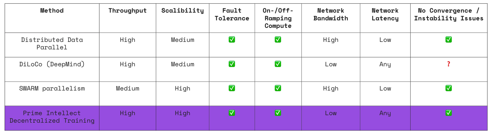
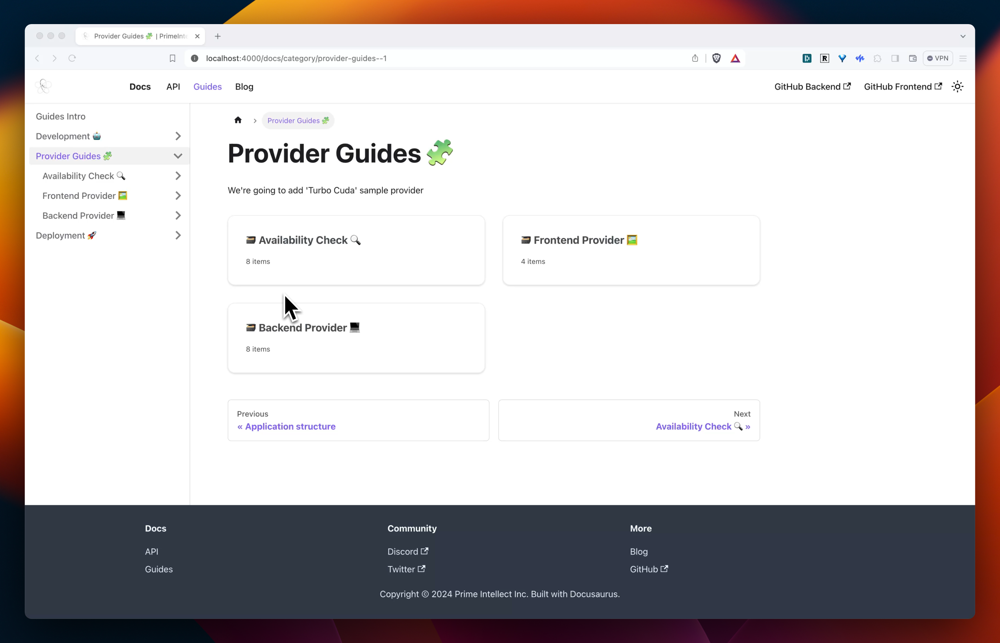
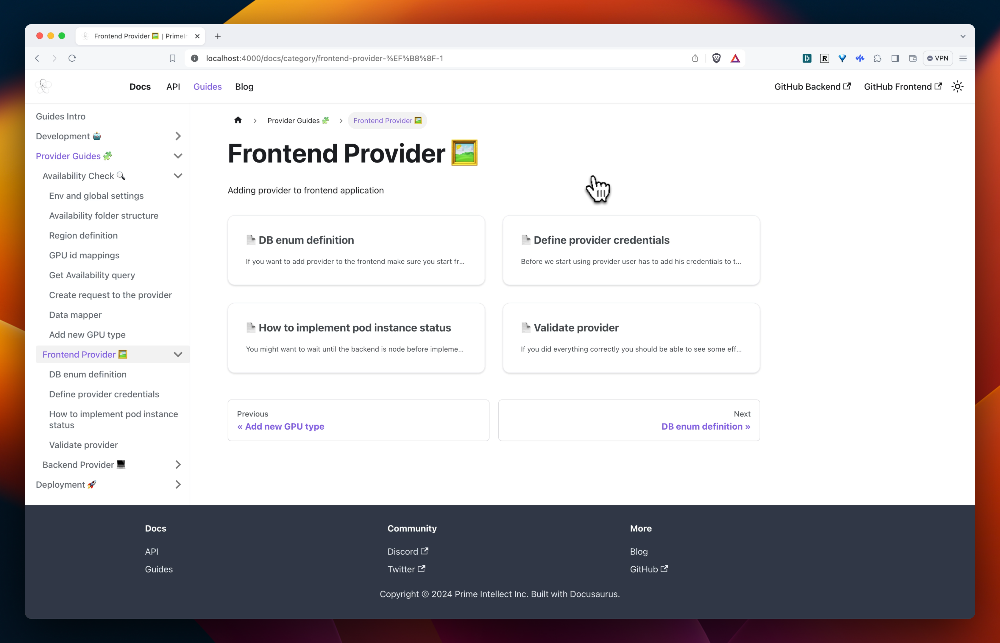
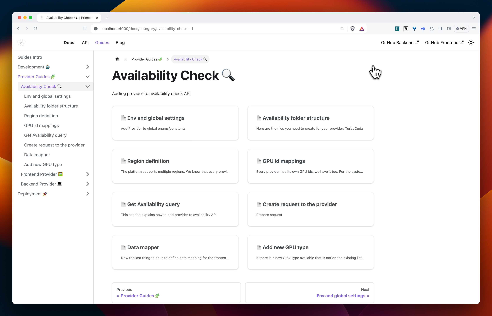
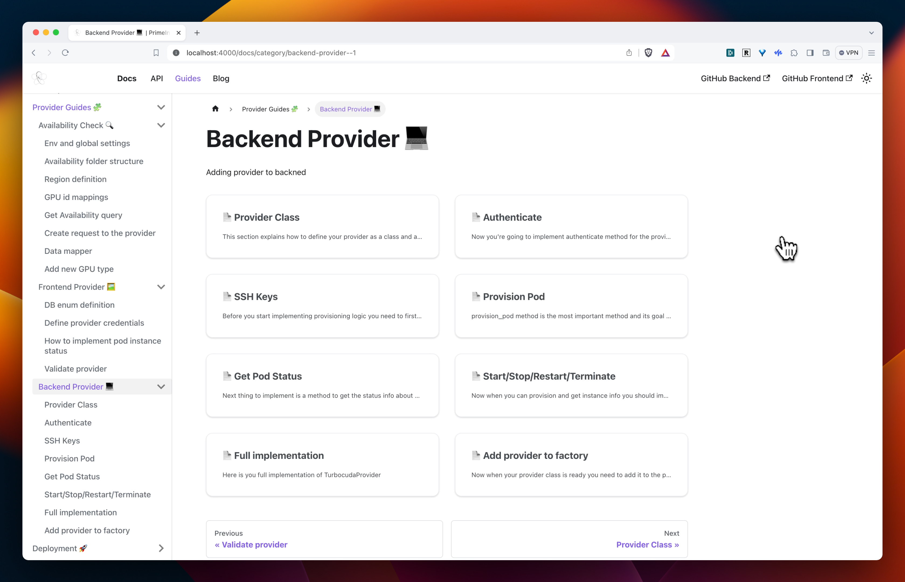
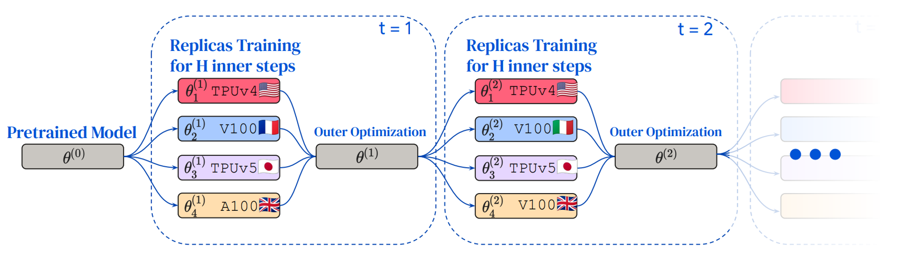

# RNP-009: Prime Intellect Compute Client

---

| RNP # | Title                  | Category | Author            | Created    | Status                |
| ----- | ---------------------- | -------- | ----------------- | ---------- | --------------------- |
| 009   | Prime Intellect Compute Client | Core     | Vincent Weisser and Johannes Hagemann | 19-03-2024 | Initial Proposal Vote |

---

## **Overview**

This proposal advocates for the onboarding of the Prime Intellect Compute Platform as a new compute client within the Render Network.

The goal of Prime Intellect ([https://primeintellect.ai](https://app.primeintellect.ai/)) is to commoditize AI compute and intelligence to advance scientific progress and human flourishing. To achieve this, they aggregate all GPU supply from decentralized & centralized clouds and surpass limitations of traditional computing infrastructure using distributed, low-communication training approaches to offer multi-node training on-demand across more cost-effective providers and spot instances.

On the AI model side, they are crafting a novel & sustainable funding model for open-source AI, making models and data licenses investable with compute.

By integrating with the Render Network, Prime Intellect seeks to maximize utilization rates of idling compute resources of Render Nodes and their revenue by plugging them into our marketplace.

## **Motivation**

The current AI compute market is characterized by high costs, market inefficiencies, and challenges in accessing multi-node instances on-demand. Prime Intellect addresses these issues by aggregating global compute, offering the cheapest and best options and enabling decentralized training across instances with optimized orchestration for efficiency.

Prime Intellect's integration with the Render Network would not only complement existing compute clients by improving utilization rates of Render Nodes, but also push the frontier on novel decentralized training research. This partnership is expected to reduce the entry barriers for AI development, democratize access to powerful compute resources, and foster innovation within the AI community.

## Prime Intellect Compute Platform

The Prime Intellect Compute Platform ([https://app.primeintellect.ai](https://app.primeintellect.ai/)) is working on the following innovations to create a more efficient compute market:

[Demo Video](RNP-009/new-demo-video.mp4)

- **Enabling multi-node instances on demand:** Most cloud providers don’t offer large multi-node clusters (beyond 8 interconnected chips) on an on-demand basis. Users seeking access to 16-128+ GPU clusters are often bound to sign lengthy, expensive contracts with providers like CoreWeave or AWS. Prime Intellect aims to integrate novel decentralized training research such as [SWARM parallelism](https://arxiv.org/abs/2301.11913) or [DiLoCo](https://arxiv.org/abs/2311.08105) by Google DeepMind into their orchestration solution to enable training across different servers to function as a unified cluster, e.g. connecting separated nodes of 1-8 H100s for training on larger configurations (8-128+ H100s). 
In summary, they are focused on developing decentralized training solutions that exhibit several advantageous properties compared to current offerings. These include:
    - Enabling multi-node training on-demand,
    - Solutions for orchestration, efficiency optimizations, node failure mitigation, infrastructure and monitoring,
    - Integrating fault tolerance to handle node failures and enabling training on much cheaper spot instances, which can result in cost savings of 2-3x,
    - Flexibility to ramp up or down compute resources during training, allowing for dynamic adjustments in the total compute based on competitive pricing and further reducing costs,
    - Scaling to larger model sizes,
    - Requiring low network bandwidth,
    - Being compatible with varying network latencies, or incorporating optimizations to minimize the network latency,
    - Avoiding slower convergence or instabilities during training.

## **Technical Integration**

We suggest creating an independent working group (The Prime Intellect-Render Working Group) based on achieving specific milestones of the following projects.

### **Prime Intellect-Render Connectors** 

Implement connectors to seamlessly integrate Render Nodes to the Prime Intellect Compute Platform, minimizing GPU idling time and maximizing profits. 

*Documentation Overview for Prime Intellect Compute Integration*

### **Price Optimization **

Develop dynamic pricing models for Render Nodes on the Prime Intellect Compute Platform to adjust prices in real-time based on market demand and supply. This aims to optimize both profit and utilization rates of Render Nodes by setting prices just under the lowest competitor rates, while ensuring they remain economically rational without falling below a certain threshold. Prices are not capped at the upper end, allowing for adjustments based on demand constraints.

### **Decentralized AI Model Training **

**Advancing the frontier of decentralized AI training on the Render Network.** An open-source reproduction of the [Distributed Low-Communication Training (DiLoCo)](https://arxiv.org/pdf/2311.08105.pdf) work by Google Deepmind on Render Nodes.

DiLoCo is a novel decentralized training approach that enables the training of language models on islands of devices that are poorly connected, making it an ideal fit for the Render Network Nodes. The method allows for training data parallel on different instances, requiring synchronization of gradients only every 500 steps. 

**Strengths:**

- Very low communication needed between instances. Ideal for distributed training on nodes with low internet speeds.
- Robust to ramping up/down individual workers and having an adaptive amount of total compute

**Limitations:**

- DiLoCo has only been tested up to a model size of 400M parameters.
- DiLoCo requires every instance to have enough GPU memory to be able to hold the parameters, gradients and optimizer states of the model (general data parallelism limitation, except for slower [off-loading methods](https://arxiv.org/abs/2101.06840)), even though these could be shared for the machines of one instance e.g. via [ZeRO-3](https://www.deepspeed.ai/2021/03/07/zero3-offload.html).
- DiLoCo is limited to a synchronous setting → Fortunately Google Deepmind kindly did some research for this already that they released on January 18, 2024, extending DiLoCo to the asynchronous case, making it possible to run on heterogenous devices.
    
    → [Asynchronous Local-SGD Training for Language Modeling](https://arxiv.org/abs/2401.09135)
    

Although the algorithm and promising experiments results for DiLoCo were published by Google, no open-source reproduction exists to date. We believe these advances shouldn’t be reserved for a few players at large research labs but be open-source, available to the [GPU-poor](https://www.semianalysis.com/p/google-gemini-eats-the-world-gemini).

The Prime Intellect-Render Working Group is eager to pursue follow-up projects after the successful completion of these initial projects to further strengthen the Render ecosystem. Future projects could include the integration of spot instances, as the Prime Intellect decentralized training stack already manages this, or enabling Render Node Providers to contribute their compute power to the most promising AI models in exchange for ownership and governance in the models (AI [IP-NFTs](https://docs.molecule.to/documentation/ip-nfts/intro-to-ip-nft)).

Prime Intellect will start as soon as possible with the goal towards launching within a quarter. 