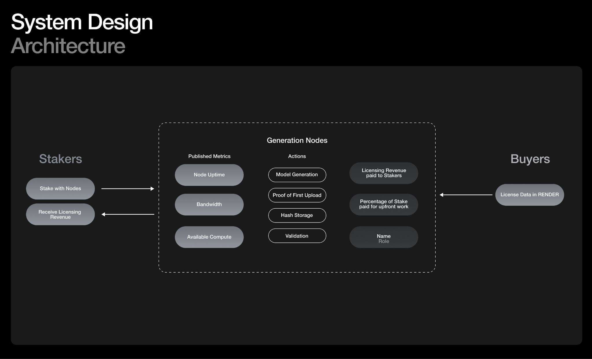

# **RNP-011: Piwa — Creating Millions of 3D Training Assets**

---

| RNP # | Title                                           | Category | Author        | Created    | Status           |
| ----- | ----------------------------------------------- | -------- | ------------- | ---------- | ---------------- |
| 011   | Piwa — Creating Millions of 3D Training Assets | Core     | Emad Mostaque | 27-03-2024 | Draft Submission |

---

**Overview**

The Render Network, over the past seven years since its inception, has
pushed the boundaries of media through its best in class GPU network.
Petabytes of data — both from 3D scenes and of their 2D outputs — have
flowed through the network, and Render has become instrumental in the
workflows of artists and 3D creators the world over.

Stability AI has made significant strides in democratizing AI technology
and fostering innovation through its open-source approach. Contributing
models, training datasets, and more, Stability's accomplishments
continue to advance the realm of artificial intelligence.

As large AI models continue to find success, data availability presents
itself as one of the greatest barriers towards the advancement of AI.
Large datasets like ImageNet have created models like Stable Diffusion;
language datasets have created large language models like GPT-4.
Stability, together with Render, can take the next step towards 3D
artificial intelligence by creating and augmenting one billion 3D assets
for model training.

Render nodes will participate in asset creation and storage. Buyers
interested in using the dataset will pay exclusively in RENDER on the
network. Users will have the option to stake RENDER and then receive
rewards from nodes who generate training revenue.

**Category**

This is a Core Proposal within the technical subcategory.

**Motivation**

The pace of AI advancement over the past years — and months — has
broken technological barriers by demonstrating exceptional capabilities.
What has enabled the success of this recent wave of AI models? Data.
Models like Chinchilla and LLaMA consume trillions of web crawled
tokens. Billions of images via web crawled data sets allow for
impressive image generation models to exist.

Language and image datasets have found success with scaling, but other
forms of data have been left behind. 3D datasets like ShapeNet — the
only comparable data source in the realm of 3D — are exclusively
advanced by individuals manually creating and sharing assets. In short,
the process for training 3D models is nearly impossible to scale. Data
scarcity has become a bottleneck for learning-driven methods in 3D
artificial intelligence. Previously Stability AI funded and supported
the creation of Objaverse-XL
[https://stability.ai/research/objaverse-xl-a-colossal-universe-of-3d-objects](https://stability.ai/research/objaverse-xl-a-colossal-universe-of-3d-objects),
the largest publicly available 3D dataset which has enabled the latest
wave of generative 3D models. High quality multiview 3D opens up
improved image, video and virtual world models. These in turn can create
better data that make the next generation of models even better, a
powerful feedback loop to enable fully immersive media, interactive 3D
and increased photorealism.

Creating a dataset of 1 billion 3D assets will provide the foundation
for the next generation of 3D artificial intelligence. This RNP aims to
accomplish that.

**Stakeholders**

This proposal impacts all members of the Render Network community.

**Implementation**

_Overview_

Stability AI will work with the Render Network to create a dataset for
3D asset training. Leveraging the multi-actor composition of the Render
Network, nodes, users, and community members will be able to participate
in the creation (and benefits) of this dataset. To train models using
this dataset, Buyers will need to license the dataset with RENDER
tokens.

_Implementation_

To participate, RENDER nodes will opt into training by running a
lightweight external client. This client will be maintained by Stability
AI and developed on GitHub with participation from the broader Render
open source community. Stability AI will facilitate 3D generation with
the Render Notes running this external client.

Staking will be utilized to power this training work for two reasons.
One: staking will incentivize nodes to work in good faith as users can
choose to restake and therefore deprioritize bad faith nodes. Two:
staking is an effective mechanism to provide rewards for users and nodes
that choose to engage in this upfront training and data storage
investment.

Provenance information for generated 3D data will be recorded as
[compressed NFTs on
Solana](https://developers.metaplex.com/bubblegum/stored-nft-data).
All assets created during the 3D data generation run on the node will be
immediately hashed and sent to the Render Network ledger and file system
(users can optionally package data as an ORBX geometry node asset)
effectively generating a Proof of First Upload for assets to be used in
future Render jobs or training jobs. This process will tie the generated
assets to Render Network node operator\'s wallet, and a Solana
compressed NFT will be utilized to store and track 3D metadata.

Today, the Render Network generates a current Proof of First Upload for
all texture, mesh and auxiliary scene datasets used for Render jobs.
Proof of First Upload is just one layer of provenance leveraged for
royalty and attribution systems such as the RNP proposed here, with the
second being pre-hashing of assets that override POFU for known, high
reputation 3D data sources (KitBash3D, LightStage, etc.).

After the successful generation of the dataset, Buyers interested in
running models on the dataset can do so through an interface that allows
them to pay for the data and license it for a given amount of time.
Users will need to pay in RENDER, and revenue generated from will flow
back to Nodes and Users who participated in the generation of the
dataset.

Generation Nodes will perform their work through a stake weight
mechanism. By staking RENDER tokens, users support these generation
nodes, which, in turn, earn rewards proportional to their volume of
generated models. This approach incentivizes honest and thorough model
generation, ensuring the dataset's quality and trustworthiness.

- **Generation Nodes**: Independent nodes are tasked with generating
  3D assets. These nodes run an independent daemon specifically
  designed for the generation and provenance creation of 3D assets.
  Once an asset is created, the node submits 3D metadata to a Render
  oracle that releases a cNFT that verifies asset validity.

  - Generation Nodes will post relevant information every 12 hours,
    such as liveness, bandwidth, compute power, and number of assets
    generated.

  - Generation Nodes will store lightweight hashes of cNFTs on their
    local machine, and potentially use additional decentralized file
    storage mechanisms (ala Filecoin) to store larger file backups.

- **Revenue Distribution**: Revenue for model licensing will be
  distributed based on a stake-weighted system. Until 1Bn assets have
  been created, 50% of all license revenues will go back towards
  generating additional data. Generation Nodes earn revenue
  proportional to the amount of 3D assets generated. Stakers receive a
  percentage of said revenue.

- **Staking Process**: RENDER token holders can stake their tokens
  with Generation Nodes. Stakers can manage their stakes, allowing
  them to select Generation Nodes based on performance metrics,
  historical accuracy, and other relevant factors.

_Beyond Generation_

Alongside model generation from Render nodes, this RNP will create a
frontend allowing artist participants in the Render community to upload
their own 3D assets for inclusion in the dataset, additionally creating
a Proof of First Upload record.

_Data Labeling and Quality_

Community members, beyond staking with Generation Nodes, will also be
able to participate in the labeling of generated 3D data in service of
the enhancement of the dataset. Through another frontend interface,
RENDER token holders will be able to connect their wallet and help with
dataset labeling and filtering mechanisms. NSFW content and other
relevant tags will be added to models alongside quantitative quality
metrics related to the generated models.

_Inference_

Stability AI will run any hosted inference services that were trained on
the data exclusively on Render Network nodes.

_Funds_

In order to allocate resources towards this initiative, leftover RENDER
from liquidity pool incentives earmarked in RNP-006 will be reallocated
to this work.
