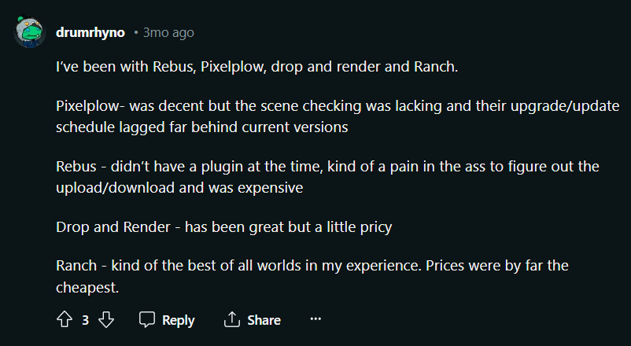
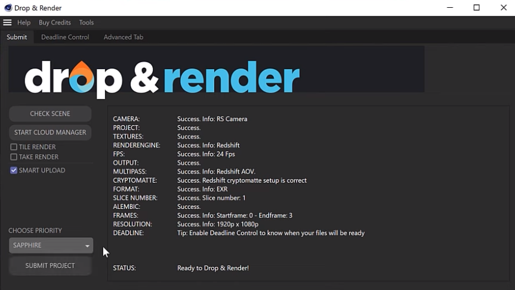
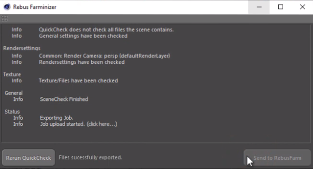
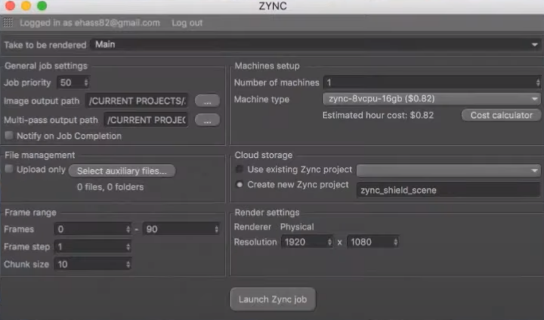
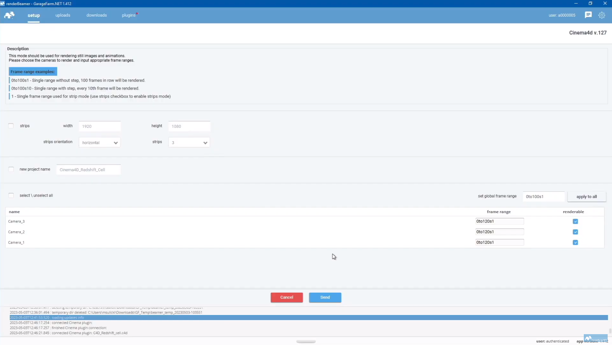
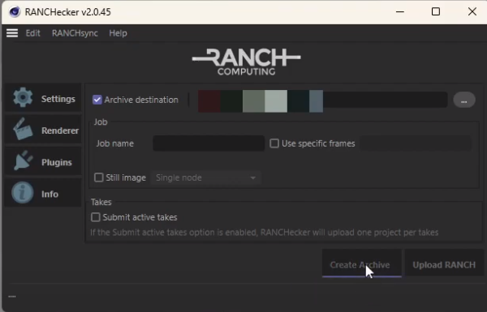
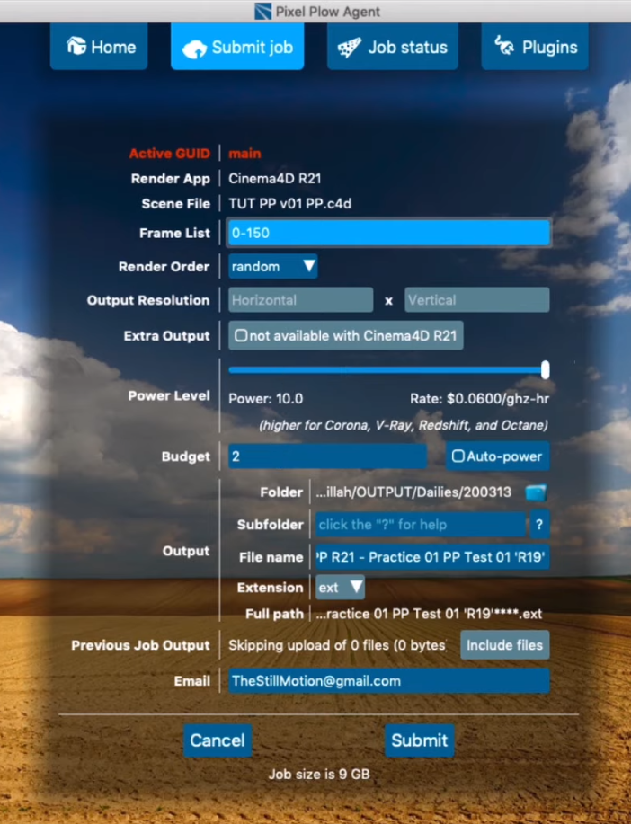
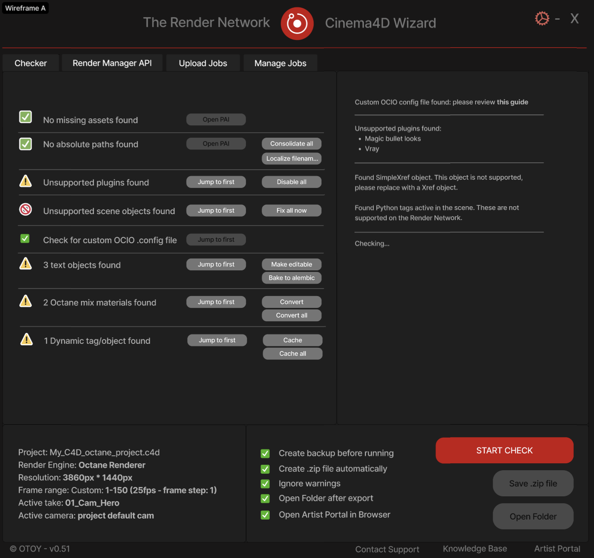

# RNP-012: Render Network Wizard for Maxon Cinema 4D

| RNP # | Title | Category | Authors | Created | Status |
| ----- | --------------------- | -------- | ------------------ | ---------- |------- |
| 012 | Render Network Wizard for Maxon Cinema 4D | Core | Dino Muhic | 04-08-2024 | Draft |

## Overview

The Render Network recently added native support for Maxon's Cinema 4D,
a 3D computer animation, modeling, simulation, and rendering software.
We are approaching an important milestone as this integration is coming
out of beta in the coming weeks. In order to maximize the value of this
new capability we seek to build a closer integration with the Cinema 4D
application itself.

Once launched users can upload .c4d project files to the network. This
removes a step for the clients which so far had to export to the Octane
specific .orbx file format and also unlocks support for Standard
Renderer and Physical, and Redshift by Maxon being supported soon,
besides the already fully productive OctaneRender support.

The process to prepare your files for the network is written down in the
[knowledge-base
guide](https://know.rendernetwork.com/getting-started/cinema-4d-on-render-network-beta-guide/preparing-your-cinema-4d-file-for-the-render-network).
However, in order to lower barriers of entry for new users we want a
tool, preferably in Python, that does all the necessary steps
automatically (supporting multiple render engines).

For streamlining the experience of using the Render Network with native
Cinema 4D project files, a Render Network wizard will automate certain
checks, which currently have to be done manually by the artist. Some of
which are:

- Checking the scene for missing assets, offer help to
  collect/consolidate those

- Check for uncached dynamics, -\> cache them (or offer help to cache
  them)

- Check for plugins which might perhaps not be supported

- Check for unsupported tags or disable those which are not needed to
  save render or prep time

- Check for text objects and convert those to splines/geo

- Notify the user of smaller issues, which could speed up rendering,
  upload time or save render costs

We believe this will increase the value of the Render Network, make it
more discoverable for Cinema 4D Octane users and make it a more
integrated part of the artist\'s workflow.

Given the Octane dependency for much of this, OTOY has taken the
initiative here running a RFP process (see the appendix), and has
selected a vendor from the 3 proposals received. We are looking for the
community's approval to proceed with this initiative.

The vision is to replicate this process in the future with other popular
DCC's like Blender and/or Houdini further simplifying usage of the
Render Network.

## Motivation

The process to prepare your files for the network is written down in a
[guide in our
knowledge-base](https://know.rendernetwork.com/getting-started/cinema-4d-on-render-network-beta-guide/preparing-your-cinema-4d-file-for-the-render-network).
However, we would like to build a tool, preferably in Python, that does
all the necessary steps automatically (supporting multiple render
engines).

Scene checking and DCC plugins are a critical part when it comes to
clients selecting their preferred render farms. The support team has
heard this from the Render Network clients and it is also a relevant
topic in many online communities as seen in one of the examples below:

[https://www.reddit.com/r/Cinema4D/comments/18hexec/whats_the_best_c4d_redshift_render_farm_and_why/](https://www.reddit.com/r/Cinema4D/comments/18hexec/whats_the_best_c4d_redshift_render_farm_and_why/)

Checking the scene is a crucial part when using a render farm in order
to ensure the results retrieved from the farm's nodes are identical to
the local result, which is what the artist expects. If the scene is not
correctly being checked this therefore can lead to customer's
dissatisfaction and user churn.

Given the lengthy process for preparing and checking scenes for render
farms, having a wizard which does a lot of the work for the user is best
practice for render farms.

The wizard will add the following value to the Render Network:

- Make the Render Network better discoverable for Cinema 4D Octane
  users

- Lower the barrier of entry for new users

- Improve user experience overall

- Reduce not useable outputs for artists

- Reduce support workload caused by not useable outputs

- Avoid user churn caused by bad results due to not well conducted
  scene checking

- Support a full launch of the Render Network to C4D Octane clients

- Prepare smooth launch for C4D Redshift clients

Such native wizards for a DCC like Cinema 4D is industry standard and
provided by all major render farm service providers. See below for a few
examples:

|                                      |                                      |
|--------------------------------------|--------------------------------------|
|  |  |
| **Source:** [Watch Video](https://www.youtube.com/watch?v=aWhBwQapXYA) | **Source:** [Watch Video](https://www.youtube.com/watch?v=dbHzJwMCSww) |
|                                      |                                      |
|  |  |
| **Source:** [Watch Video](https://www.youtube.com/watch?v=cYKuml9B9fk) | **Source:** [Watch Video](https://www.youtube.com/watch?v=CyKQingW65A) |
|                                      |                                      |
|  |  |
| **Source:** [Watch Video](https://www.youtube.com/watch?v=Xb25lWMXC1A) | **Source:** [Watch Video](https://www.youtube.com/watch?v=2O5oPiFVzF0) |

## Stakeholders

Render Community - approval of project

OTOY - Budget, Selection of Supplier, Project Management

Render Network Client Success Team - Specification, Testing,
Documentation

3rd party developer - Implementation, Documentation, Maintenance

## Implementation

1\. Scope of work (initial release version)

A python-based wizard for Cinema 4D users to easily check their project
file, before submitting it to the Render Network for distributed online
rendering.

The wizard should check general Cinema 4D settings, but also render
engine-specific objects for Octane Render and Redshift.

- Platforms: Windows and MacOS.

- Minimum supported Cinema 4D version: 2023.2.1

- Minimum supported Octane version: 2022.1

- Minimum supported Redshift version: 3.5.

Example UI Mockup

For the Render Network itself we have defined personas with 3D Artists &
designers from the major branches of the industry to have a common
understanding who we want to build the network for in the first place.
These persons apply also for creating the wizard.

| Persona                         | Need                                                                                                 |
|---------------------------------|------------------------------------------------------------------------------------------------------|
| **Olivier (arts school student)** | - Render my first project which would be almost impossible on a laptop. - Get work done. - **Need: Render one small image to see how it all works.** |
| **Fred (artist)**                 | - Render 1000 different scenes (e.g., product renders) in one batch. - Easily create a preset or (download) implement one made by someone else. - **Need: Generate variation of looks just with the help of presets and quick previews.** |
| **Bob (light & render specialist)** | - Render multiple scenes in one batch and use one preset combined by name. Make several batches like that. - Select preset and then: upload > render > auto-approve > download in one run without touching the app. - **Need: Automate render process & save time.** |
| **Fabio (3D generalist)**         | - Render a carefully crafted scene without intention to edit or retouch it after. - Render a 40000 px wide artwork with passes. - **Need: Render non-optimized scenes in high resolution by brute forcing quality.** |
| **John (interior designer, stock modeler)** | - Render a turn-table, (are there other interesting standard animations for presenting objects?). - Render a 10 min city flyover video with interiors & exteriors (18000 frames). - **Need: Repeatedly render architectural flyovers or turn-table presentations.** |
| **Viktor (video editor, 3D generalist)** | - Render multiple projects in one batch and with one preset, but with render results spread between different folders. - Render video (up to 30 sec, 750 frames) in the blink of an eye. - **Need: One click solution (same preset) for all projects. Send & forget.** |
| **Alex (3D generalist, blogger)** | - Make several test renders before getting the final result. Preferably, finish rendering that job which fits the project without needing to re-render the complete frames from the test. - Render very heavy video in 8K into multi-layer EXR sequence. - **Need: Meet the client's deadline.** |

The team already went forward writing a Request for Quote detailing an
initial release version in detail, see appendix for more details.

## Technical Considerations

Note that C4D interfaces are limited by the aesthetics of Cinema 4D:

- Colors are controlled by the users C4D preferences

- Fonts and text scale are largely pre-determined by C4D.

- Precise spacing is limited as well.

- Images can be used to create custom buttons.

**I. Wizard Delivery**

The wizard should include:

- Wizard Interface Design

- Wizard Programming

- Beta Testing

- Code Documentation

- Final delivery

**II. Wizard Maintenance**

Ongoing updates to maintain compatibility and extend to Redshift for
Cinema 4D are required.

## Drawbacks

TBD
