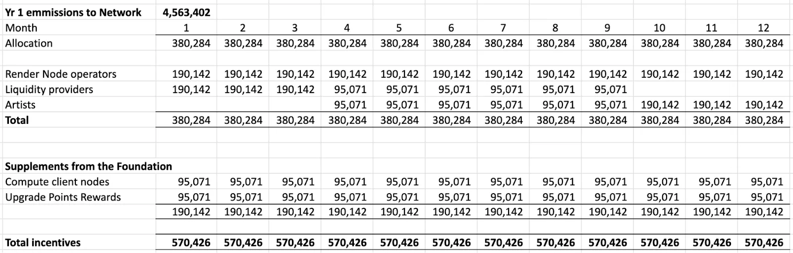
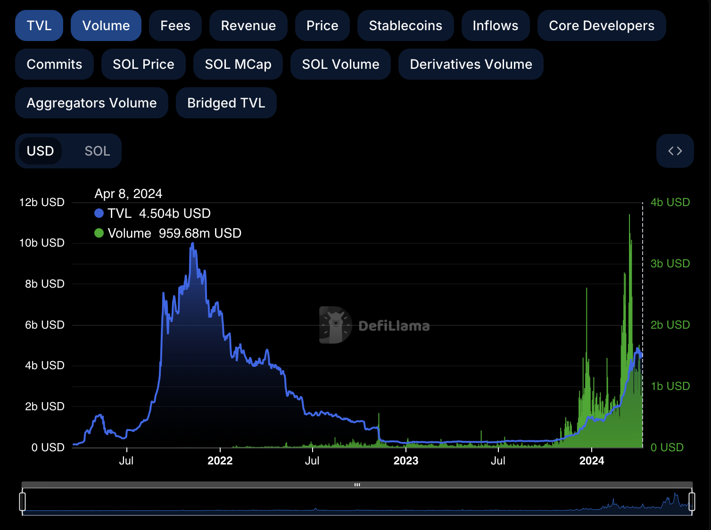

# RNP-013: Year 1 Emissions Rebalancing

| RNP # | Title | Category | Authors | Created | Status |
| ----- | --------------------- | -------- | ------------------ | ---------- |------- |
| 013 | Year 1 Emissions Rebalancing | Core |  | 04-15-2024 | Draft |

## Overview

Following the first quarter of the Burn-Mint-Equilibrium, the effects of
the new economic model are now live and well within the Render Network.
Learning from the market dynamics, this RNP aims to rebalance the
network emissions passed by the community in November of 2023 in
RNP-006, and proposed in January 2023 in RNP-001. New opportunities have
proven that the initially proposed budget from the Year 1 Emissions can
be improved to meet the adapted goals of the Network.

This proposal seeks to align incentives in a more equitable manner, and
to allocate such incentives to where they are currently most needed in
order to continue to support the long term growth of the Render Network.

## Motivation

With the impact of Artificial Intelligence set to unfold over the coming
decades—not years or months—the network must preserve emissions for
future applications in AI while also expanding current usage in our 3D
rendering product. As a result, this RNP proposes to reallocate
emissions in RNP-006.

The total amount of current network emissions today remains unchanged.
However, some emissions that are underutilized today will be shifted:
emissions will be allocated to a new pool for AI dataset generation and
customer acquisition. All of these emission pools will have a longer
release structure. The effect is a slower release of network emissions
that is better synchronized with the growth of new applications
beginning with proposals such as RNP-011. Stakeholders are able to
participate in these future emissions, and may receive reputational
multipliers for their early contributions to the network, providing long
term incentive alignment.

Current Allocations

To recap, here is the current allocation schedule as approved by RNP006:

The split of total allocations to node operators, which currently
includes both Render Node operators and Compute client nodes, is out of
proportion with total node emissions over-allocating to the volume of
Render and Compute work processed.. Further, the simple emissions
apportionment has resulted in a few nodes getting the majority of these
excess rewards, while many nodes are under-allocated in current
emissions.

Liquidity provider allocations have also not been necessary to deploy.
For context, when RNP-001 was proposed - with emissions for liquidity
provider incentives - volumes on Solana DEXs were significantly lower
than they are now. The BME required a liquidity bootstrapping mechanism
to operate efficiently. Today, Solana DeFi volumes are consistently over
50-times greater than what they were when these rewards were proposed,
and are now at parity with Ethereum DeFi volumes, eliminating the need
for additional liquidity provider incentives in addition to existing 3rd
party Solana DEX fee incentives.

(source: [DeFi
Llama](https://defillama.com/chain/Solana?volume=true)).

While significant rewards were reserved for Artists, and artist growth
is needed, the total volume of rewards significantly exceeds the current
volume of Render and Compute work, and some can be re-allocated to other
new growth initiatives.

As of the end of April, 1,521,132 RENDER will have been allocated,
leaving 3,042,272 of first year emissions for allocation below.

Modifications

1.  **Node Operator Job Rewards** will continue to be paid weekly for
    the foreseeable future. Node Operator Job Rewards per weekly epoch
    will be reduced from 47,435 RENDER to 15,000 RENDER (480,000 for the
    rest of year 1)**.** Nodes performing Render or Compute Client work
    during an epoch will continue to receive a relative percentage of
    node operator rewards as outlined in RNP001 and RNP004.

2.  **Availability Rewards** will be extended to also include Render
    Node availability in addition to Compute Client availability.
    Availability rewards will be reduced from 95,071 per month to 25,000
    RENDER per month, with a further 50,000 being reserved for Compute
    Client test jobs on the Network (250K for the rest of year 1). The
    25,000 RENDER per month will initially be split equally with 12,500
    allocated to Render Node availability and 12,500 to Compute Client
    Node availability.

    a.  **Render Node availability.** The allocation mechanism should be
        addressed in a future RNP and aims to improve the equity of node
        emission allocations

    b.  **Compute Client availability rewards** will continue to be
        calculated in the same manner as RNP006, with the following
        changes:

    1.  Nodes will need to be available for a minimum of 50% of each
            monthly epoch to qualify.

    2. The maximum per node availability reward will be 10 RENDER per month
    (with total node availability rewards subject to the total
    12,500 monthly cap).

    3. Should a node not supply a valid SPL wallet within 1 month of performing work, it will forfeit its rewards. Such forfeited rewards will go to additional Compute Client test
jobs on the Network.

3.  **Data generation rewards** (proposed in RNP-011 and soon to be
    expanded in upcoming RNPs) will be funded by reallocating the
    remaining Liquidity Provider Emissions of 1.14M to Data Generation
    rewards, potentially representing 95,071 per month.

    a.  Generation Node Rewards will have a ramp period: a maximum of
        50% of the sum total remaining in generation node rewards can be
        spent in any one 12 year period. This will create a half life
        preserving the emissions for the long-term dataset generation
        work.

    b.  A staking cap will be introduced for Generation Node stakers to
        ensure functional economic incentives.

4.  **Artist Allocations** will be reduced to 50,000 RENDER per month
    for the remainder of the year.

    a.  Artist rewards will be emitted proportional to work paid on the
        network in the form of rebates, and earmarked for ambassadors,
        new user acquisition and referral programs with the goal to
        attract additional paying users on the network.

    b.  Exact mechanisms will be addressed by subsequent RNPs, which
        should be shaped and informed by community member feedback and
        suggestions.

**Monthly rewards after the passing of Month 4\***

| Category              | Per month |
|-----------------------|-----------|
| Node Operator Rewards | 85,000   |
| Artist Rewards        | 50,000    |
| Upgrade Point Rewards | 95,071    |
| Total                 | 230,071   |

**Earmarked Allocations**

| Category                         | Total                                                                             |
|----------------------------------|-----------------------------------------------------------------------------------|
| Data Generation Rewards          | 95,071 per month, total of 1,140,852, with maximum spend of 50% of remaining pool |
| Compute Client Test Jobs Rewards | 50,000 by end of year 1                                                           |

*approximations based on weekly rewards. Additionally, some months
will have four epochs, others will have five.

In summary, emissions are rebalanced to reduce upfront emissions, which
are underutilized today, and re-allocate them to longer term network
expansions like RNP-011, which require additional compute resources. By
changing the sequence of emissions release, the network has a mechanism
to incentivize long term expansion of network infrastructure without
introducing new emissions. Advances in the Solana ecosystem - like the
remarkable growth of Solana DeFi protocols - enable this rebalancing to
occur. Meanwhile, changes in compute emissions are recalibrated to more
closely capture work on the network, including adjusting emissions
distribution to improve allocation equity. RNP-014 provides more detail
on Compute Availability Rewards, and forthcoming RNPs associated with
RNP-011 aim to introduce mechanisms for existing network stakeholders to
participate in the future compute initiatives funded by this emissions
rebalancing.

## Stakeholders

This proposal affects all participants of the Render Network.

## Implementation

Following the passing of this proposal, the new rewards schedule will be
enacted after the conclusion of the nearest month.

## Technical Considerations

n/a

## Drawbacks

Rebalancing emissions is more of an art than a science. This proposal aims to correct a very eager emissions allocation proposed with the explicit goal of growing network usage. With the support of the community, we hope to strike a balance between allocating tokens to existing Network participants and finding new ways to utilize BME to grow the Render Network.

We intend to monitor this going forward, and should volumes change materially or new opportunities emerge, changes will continue at least on a quarterly basis going forward (via the RNP process).
