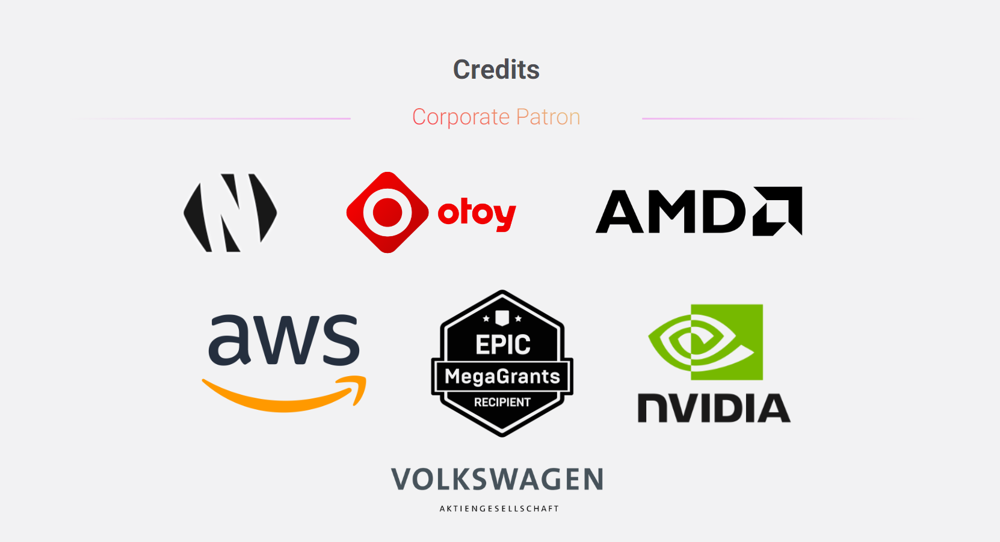

# RNP-014: Integration of Blender Cycles in the Render Network

| RNP # | Title | Category | Authors | Created | Status |
| ----- | --------------------- | -------- | ------------------ | ---------- |------- |
| 014 | Integration of Blender Cycles in the Render Network | Core | Steven Scott, Dino Muhic | 04-18-2024 | Draft |

#  Overview

## Proposal Summary

Blender 3D the free and open-source 3D computer graphics software tool
set used for creating animated films, visual effects, art, 3D-printed
models, motion graphics, interactive 3D applications, virtual reality,
and, formerly, video games.This proposal is to integrate Blender Cycles
with the Render Network This initiative will support the growing
community of over 2 million Blender users worldwide by providing them
with seamless access to the powerful and scalable rendering resources
offered by the Render Network.

## Background

Cycles is Blender's physically-based path tracer for production
rendering. It is designed to provide physically based results
out-of-the-box, with artistic control and flexible shading nodes for
production needs. Blender would benefit from easy access to the entire
Node Operator infrastructure of the Render Network, powering fast
rendering speeds of Blender projects for millions of users.

# Motivation

## Expanding Possibilities for Creatives

Democratization and decentralization are core missions for both parties:

-   The Blender Foundation provides open-source software for creatives.

-   OTOY provides a free Prime tier license for the Blender OctaneRender
    plugin and initiated the decentralized Render Network.

This initiative not only expands the creative possibilities for Blender
artists but also reinforces the Render Network\'s commitment to
fostering a decentralized and democratized environment that leverages
the strengths of various industry-leading tools and pipelines.

## Blender Ecosystem Adoption

Blender is one of the leading 3D digital content creation tools for
OctaneRender, and this integration with Blender Cycles also aims to
reach out to the 2 million Blender users who may not yet be familiar
with the Render Network.

## Expanding the Blender Ecosystem

This initiative and the ones that will follow also present an
opportunity to expand the Blender ecosystem itself. By offering a fully
production-ready rendering option with OctaneRender that complements the
open-source Cycles renderer, we can appeal to professionals and
production studios.

This positions the Render Network as a catalyst for the growth and
professionalization of the Blender community. By actively facilitating
the expansion of the Blender user base, we can further garner
credibility and recognition from that community.

## Blender Development Fund

In February 2024, OTOY announced its backing of the Blender Development
Fund
([https://80.lv/articles/otoy-now-backs-blender-development-fund](https://80.lv/articles/otoy-now-backs-blender-development-fund)),
further demonstrating its commitment to the Blender ecosystem.

## Blender Integration with Other Production Pipelines

As highlighted by Jules at BCON23, OTOY is actively working on
integrating Blender with other pipelines and tools used in production,
such as Cinema 4D and Unreal Engine. This integration with the Render
Network aligns with these efforts:

> "Many of the Roddenberry Archive artists use Blender and it has been
> really instrumental and essential in making this happen.\"
>
> \"We\'ve been working on integrating Blender with other pipelines and
> tools used in production, such as Cinema 4D and Unreal Engine. We\'re
> building tools that can take Blender\'s scene graph and run it through
> another process, enabling live linking with super-fast performance.
> This allows seamless collaboration between Blender and other software
> in the artistic and asset creation workflow.\"
>
> \"We\'re exploring industry standards like USD and MaterialX, which
> are being adopted in Blender, to facilitate integration. However,
> we\'ve also been developing our own tools and pipelines to enable a
> seamless workflow - from modeling in Blender, to rendering in
> OctaneRender, to virtual production on LED walls using Unreal Engine.
> This allows us to leverage the strengths of each software in a
> cohesive pipeline.\"
>
> \"The Hydra render delegate system in Blender 4 is a key piece of
> technology enabling integration. We have an OctaneRender delegate
> ready, and within Octane itself, we can load other render delegates.
> This allows us to combine renderers like OctaneRender and Cycles,
> taking their respective outputs and compositing them together
> seamlessly within a single scene. The ability to leverage multiple
> render engines in this way opens up new creative possibilities.\"

# Stakeholders 

## Blender Foundation and Developers

As an open-source project, there are no dependencies on the Blender
Foundation developers.

## Artist Community

The Artist Community will be involved in closed beta testing, public
beta testing, and suggesting and voting for third-party plugins to be
integrated.

## Render Network Developer Team

Responsible for adding the Blender executable, starting render jobs, and
integrating the necessary components.

## Render Network Client Success Team

Responsible for documentation, education, and supporting users during
the integration process.

## Render Network Foundation

Responsible for marketing and promoting the Blender Cycles integration
to the target audience.

# Implementation

## Timeline

The implementation of the Blender Cycles integration is planned for this
year.

## Market Research and Community Involvement

\- Conduct market research for third-party plugins to be integrated.

\- Implement a voting system for the artist community to suggest and
vote on which third-party plugins should be integrated over time.

## Development and Release Process

The integration of Blender Cycles into the Render Network will follow a
structured process to ensure a smooth rollout and high-quality user
experience. The key stages are:

1.  **Local Development and Testing:** The Render Network developer team
    will work on integrating Blender Cycles on their local development
    machines, conducting thorough testing and debugging to ensure
    compatibility and stability.

2.  **Developer Machines on Staging:** After the local development and
    testing phase, the integration will be deployed to the staging
    environment using the developers\' machines. This allows the team to
    test the integration in an environment that closely mimics the
    production setup, but with the familiarity of their own development
    machines.

3.  **Dedicated Staging Machines:** Once the integration has been
    thoroughly tested on the developers\' machines in the staging
    environment, it will be deployed to dedicated staging machines. This
    step ensures that the integration functions as expected on machines
    specifically configured for the staging environment, further
    validating its readiness for production.

4.  **Closed Beta Release:** After extensive internal testing, the
    Blender Cycles integration will be rolled out to a select group of
    closed beta testers. These will be artists from the Blender
    community who have experience with Cycles and are willing to provide
    valuable feedback on the integration. The closed beta phase will
    help identify and address any remaining issues before a wider public
    release.

5.  **Documentation Preparation:** During the closed beta phase, the
    Render Network\'s Client Success team will work closely with the
    beta testers to gather insights and create comprehensive
    documentation. This documentation will cover topics such as scene
    optimization, scene preparation, network usage, and troubleshooting,
    ensuring that users have the necessary resources to make the most of
    the Blender Cycles integration.

6.  **Public Beta Release:** Based on the feedback and improvements from
    the closed beta phase, the Blender Cycles integration will be made
    available as a public beta. This phase will allow a broader audience
    of Blender users to test the integration and provide feedback,
    helping to identify any remaining issues or areas for improvement.

7.  **Monitoring and Refinement:** Throughout the public beta phase, the
    Render Network team will closely monitor error rates, support cases,
    and user feedback. This information will be used to refine the
    integration further, addressing any outstanding issues or
    implementing requested features.

8.  **Stable Release:** Once the public beta phase has been successful
    and all major issues have been addressed, the Blender Cycles
    integration will be rolled out as a stable release. This final
    version will be made available to all Render Network users,
    providing them with access to the powerful rendering capabilities of
    the Render Network for their Blender Cycles projects.

By following such a structured approach, the Render Network team aims to
ensure a seamless integration of Blender Cycles and to leverage feedback
and insights from the Blender community.

# Technical Considerations

The team has gained valuable experience from the previous integration
with Maxon\'s Cinema 4D, which will be leveraged for the Blender Cycles
integration. Specifically:

1.  **Encryption Solution:** The existing encryption solution will be
    utilized to secure the rendering process for Blender Cycles
    projects.

2.  **Limited Initial Scope:** The initial integration will focus on the
    Blender DCC and the standard Cycles render engine only, without
    including third-party plugins, which also initially excludes the
    OctaneRender plugin.

3.  **User Interface:** The web application UI will be extended to
    provide Blender Cycles-specific features and settings.

4.  **Outputs and Formats:** Differences in output formats, color
    spaces, and AOVs (Arbitrary Output Variables) between Blender Cycles
    and existing render engines will be addressed.

5.  **Version Handling:** The existing multi-render version handling
    mechanisms will be used to provide multiple versions of Blender and
    the Cycles render engine for artists to choose from.

6.  **Licensing:** No licensing integration is required since Blender is
    open source software.

7.  **API Extensions:** The existing Render Network web API will be
    extended to support Blender Cycles-specific functionality, enabling
    seamless integration with various desktop tools and with production
    pipelines, such as those used for virtual production.

## Artist Workflow

The workflow for artists using Blender Cycles will be similar to the
existing workflows for other DCCs (Digital Content Creation tools) and
render engines:

1.  **Mandatory scene preparation steps:** Before submitting a scene for
    rendering, any third-party plugins used in the project will need to
    be baked into explicit scene data and assets.

2.  **Scene Data and Asset Packaging:** Scenes will be saved as .blend
    files, including all scene data and assets, for rendering on the
    Render Network.

3.  **File Upload:** Users will have the option to upload either
    individual .blend files or compressed .zip archives containing the
    .blend files for rendering on the Render Network.

4.  **Render Tiers and Pricing:** For GPU rendering, the same render
    tiers and pricing model as existing integrations will be used. No
    additional costs are expected due to Blender and Cycles being open
    source software

## Render Nodes

To ensure optimal performance and compatibility, the render nodes on the
Render Network will need to be prepared for the new Blender Cycles
workloads:

1.  **GPU Scaling:** The job assigner will be optimized to ensure
    efficient GPU scaling for Blender Cycles rendering jobs, maximizing
    resource utilization.

2.  **Node Utilization:** Blender Cycles jobs therefore may improve the
    utilization of smaller nodes on the network, potentially increasing
    overall network efficiency.

3.  **Node Opt-Out Options:** Render nodes will have the option to
    opt-out of specific DCCs, render engines, or workloads, allowing
    node operators to accommodate their hardware\'s optimal performance
    characteristics.

4.  **New Hardware Requirements:** Further investigation is needed to
    determine the drive space required for Blender executables and the
    number of files that render nodes will need to download for running
    Blender Cycles jobs, requirements for additional system memory or
    special instruction sets for CPUs (e.g. AVX2).

## Outlook

**Blender OctaneRender Plugin:** After the integration of Blender Cycles
reaches a stable release, the next phase will involve proposing the
integration of OTOY\'s proprietary OctaneRender plugin for Blender. This
subsequent step will further expand the rendering capabilities available
to the Blender community on the Render Network.

**Render Network Wizard for Blender:** Consistent with the approach
taken for the integration of C4D (RNP-012: Render Network Wizard for
Maxon Cinema 4D), a dedicated wizard application will be proposed for
Blender. This wizard will seamlessly integrate with Blender, guiding
artists through the mandatory scene preparation steps and helping reduce
user errors.

By addressing these technical considerations, the Render Network team
aims to ensure a seamless integration of Blender Cycles in the existing
network architecture and infrastructure.

# Drawbacks

\- An increased number of DCC and render engine versions to maintain

\- Need for more diverse support teams supporting more render engines
and more DCCs

\- Potential challenges in GPU scaling with Cycles vs Octane

\- Potential hardware, driver, and software mismatches across different
software, affecting node performance