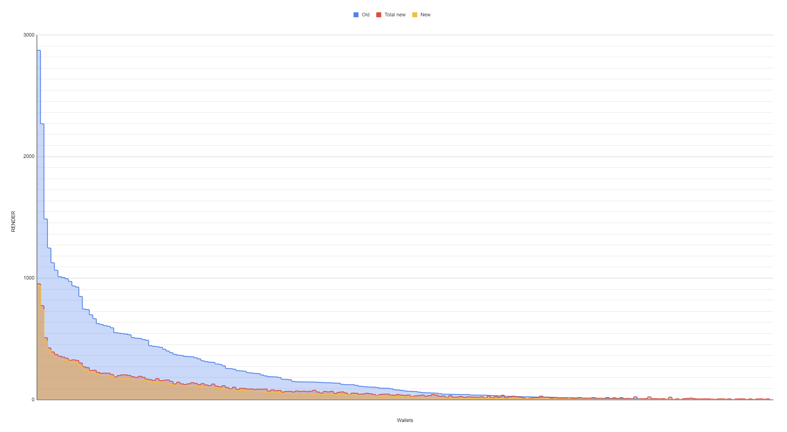
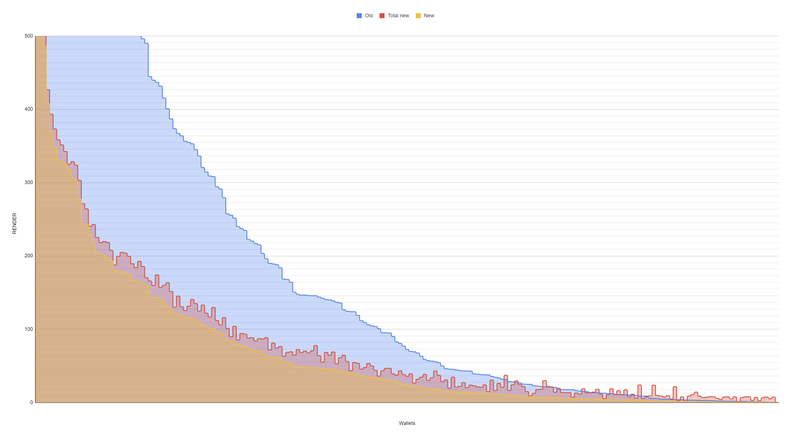

# RNP-015: Availability Rewards

| RNP # | Title | Category | Authors | Created | Status |
| ----- | --------------------- | -------- | ------------------ | ---------- |------- |
| 015 | Availability Rewards | Core |  | 05-06-2024 | Draft |

#  Overview

## Overview

This RNP aims to enumerate the mechanism for availability rewards given
to Node Operators. Availability rewards were initially proposed in
[RNP-001](https://github.com/rndr-network/RNPs/blob/main/RNP-001.md)
and are commented on in subsequent emission allocation RNPs (see:
Availability Rewards).

These rewards will compensate nodes for uptime, an essential component
for generating supply in multi-sided decentralized networks. Because the
Render Network provides on-demand GPU computing, generating supply in
advance of demand is a crucial feature of the network. Yet, Node
Operators have costs like electricity and maintenance associated with
operating a Node on the network. Availability Rewards can help offset
some earnings volatility by offering a stipend to ensure a minimum
return, enabling the network, and Node Operators, to run efficiently in
conditions of idiosyncratic demand, which are common in on-demand 3D
rendering and GPU computing services at large.

Availability Rewards are distributed according to uptime per each active
node connected to the network using a weighted points system—not just
total computing power—with the aim to more equitably distribute RENDER
rewards. As a result, Availability Rewards aim to further enhance
decentralization on the network.

## Motivation

Multi-sided networks often face a cold-start problem, where the
generation of demand requires significant supply. Without sufficient
supply, a network like Render has difficulty attracting demand that
relies on fast, on-demand availability for compute.

Token incentives are a powerful coordination tool for decentralized
networks to resolve this cold start problem. With Availability Rewards,
the Render Network will incentivize Nodes to be available for rendering
work in advance of idiosyncratic demand. As a result, when rendering or
tangential compute work arrives, Nodes will be available to complete the
work without delay, providing efficient on-demand computing services
that attract artists and developers.

A second motivation is decentralization and network robustness. The
Render Network benefits from a decentralized user base, reducing single
points of failure while increasing the diversity of service offerings
through a wide range of node operators split across regions, hardware
configurations, and usage patterns. However, despite the benefits of
decentralization, intensive rendering work may skew towards the most
powerful or largest nodes, reducing incentives for a decentralized long
tail of Node Operators. Availability rewards help resolve tradeoffs
between decentralization and efficiency by incentivizing smaller nodes
to remain active on the network during periods when large work is
assigned elsewhere.

Availability Rewards will be distributed based on proven uptime rather
than total rendering work. As a result, they will be useful in
decentralizing RENDER Node Operator rewards - providing earnings across
all available nodes, not just the Nodes with the largest amount of
computing power..

## Stakeholders

Artists, purchasers, and node operators.

## Implementation

Availability Rewards have many desired outcomes: increasing network
decentralization, incentivizing node uptime, and diversifying node
composition. As such, the below formula uses multiple factors to
calculate availability rewards.

Total availability rewards are enumerated in RNP-013. To calculate the
total reward per node, the following formula is proposed:

```

Availability rewards per node = idletime % per
epoch * (3*log(OB score)/log(Average OB score)+3*log(Node VRAM)/log(Average Node VRAM)+log(Node Age)/log(Average Node Age)) * Centralization Penalty * Weight to
allocate all availability rewards per epoch

```

The weight factor will fluctuate due to the amount of nodes online
during a given week epoch.

The above formula applies to all nodes under a given user's wallet
address. Rewards decay after 3 nodes are associated with a wallet
address.

```
def high_node_penalty(x):
    if 1 <= x <= 3:
        return 1
    else:
        decay_rate = 0.65
        return 1 * np.exp(-decay_rate * (x - 3))
```

Anti-sybil measures will be incorporated into the Availability Reward
mechanism, but may require additional updates (see: Drawbacks). These
measures could for example include background tasks (like additional
benchmarking) as a factor in uptime to prevent ineffective nodes from
idling for rewards.

The effects of RNP-013 and the given availability rewards can be seen in
the below graphs. Availability rewards incentivize smaller nodes that
receive less work on the network.



*Node payouts today vs node payouts with Availability Rewards and
RNP-013*



*Zoomed to highlight on 0-500 RENDER payouts per-epoch*

## Technical Considerations

n/a, calculations will be provided by official Render API endpoints.

## Drawbacks

Paying availability incentives instead of revenue-based metrics can lead
to negative effects such as sybil optimization and reward seeking. The
Render community should observe node availability payouts and make
relevant suggestions to improve the reward distribution process.
