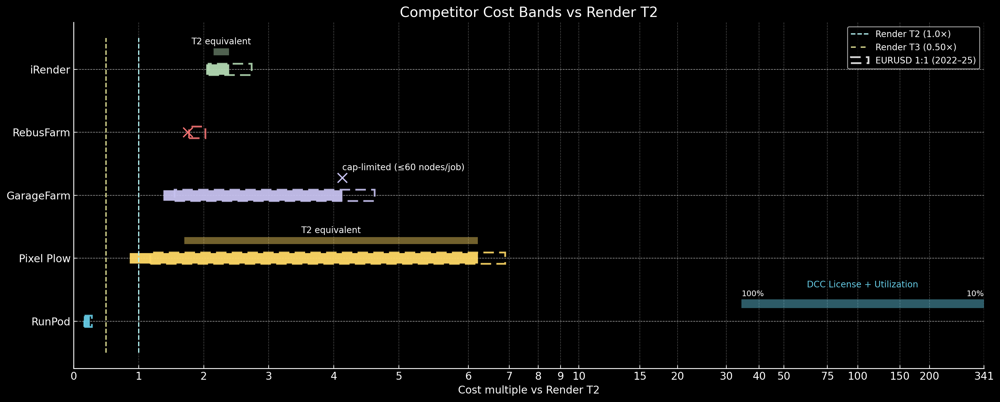
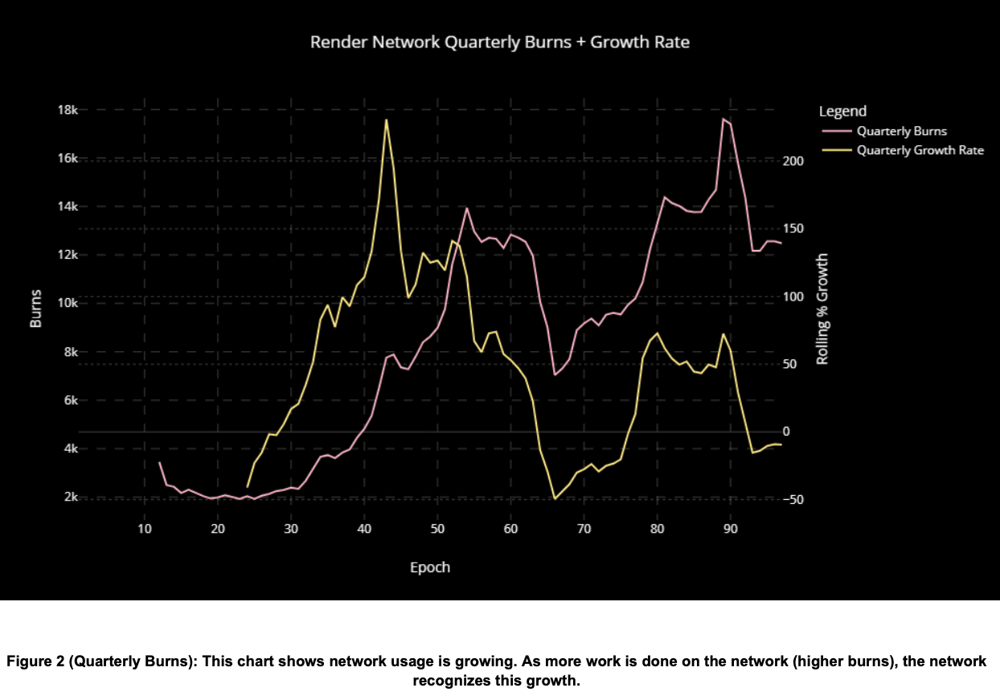
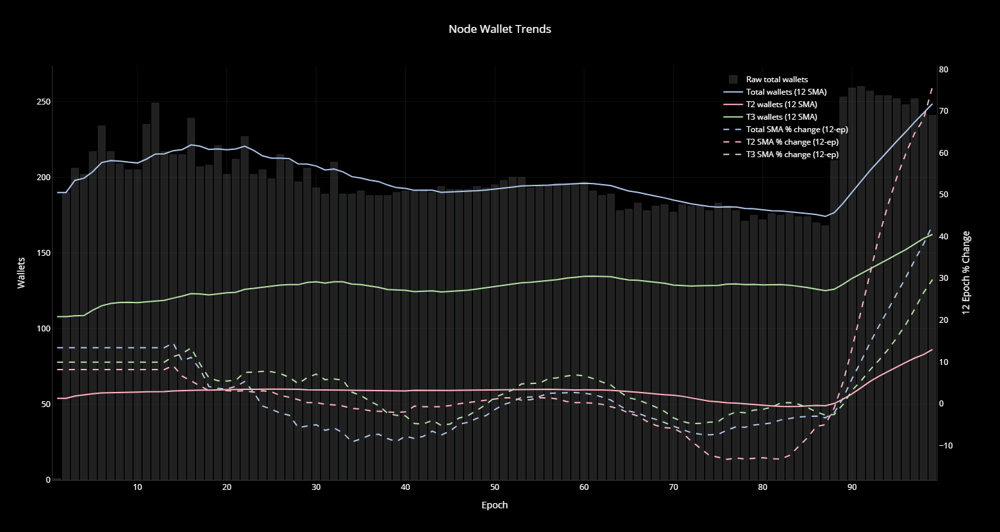
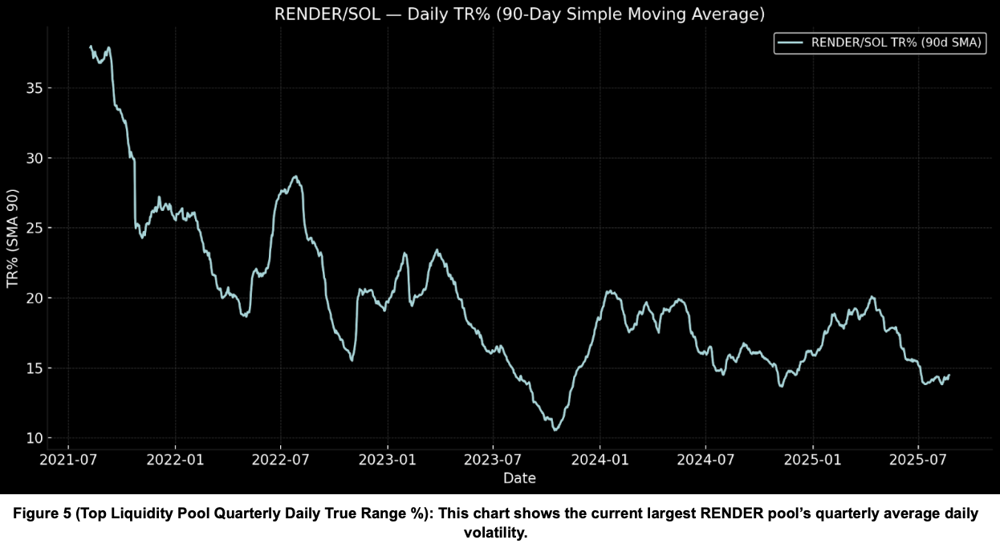
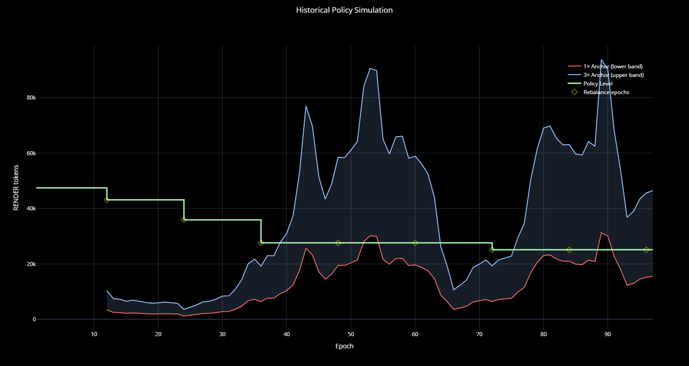
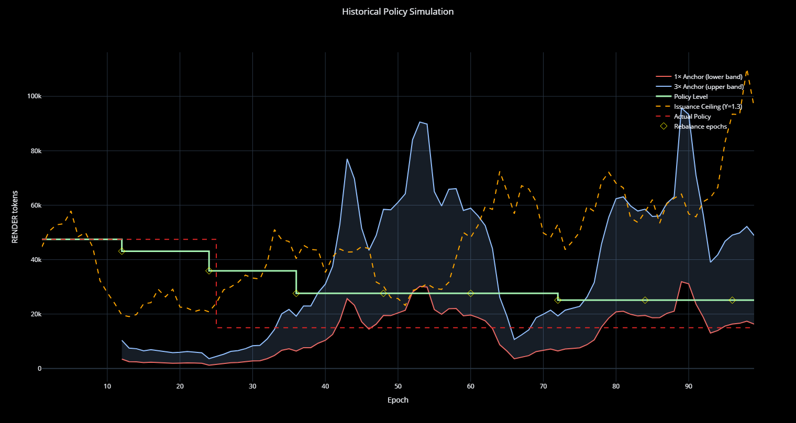
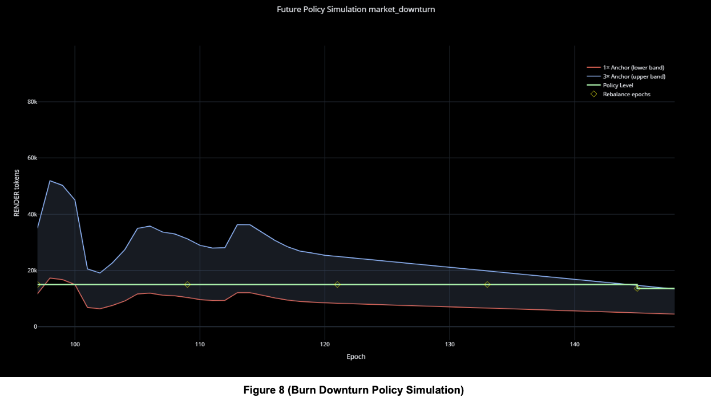

# RNP-020: Node Operator Forward Guidance Policy

| RNP # | Title | Category | Authors | Created | Status |
| ----- | --------------------- | -------- | ------------------ | ---------- |------- |
| 020 | Node Operator Forward Guidance Policy | Process | Pockets | 2025-10-28 | Draft |

# How to Vote
Visit the RENDER FOUNDATION voting page hosted by nation.io. Direct link can be found here https://nation.io/a/RenderNetwork.
You will need to have your $RENDER tokens in a self-custody wallet (i.e. Solflare, Phantom, etc.). 
You will need enough $SOL in your wallet to conduction onchain trasactions (0.1 SOL is more than enough).
Visit the Proposals Page and select the ACTIVE proposal you wish to vote on.
Pick your vote and complete the transaction by signing a message affirming your vote.

# Overview

The purpose of this policy is to establish a transparent, data-driven framework for determining issuance adjustments based on observable on-chain metrics. This system ensures stability while maintaining responsive adjustments to market dynamics.

This proposal seeks to enhance clarity and provide a stable, predictable economic framework that better aligns the incentives of all network participants.

This proposal introduces a new, automated policy that acts like a smart thermostat for the network's economy. The policy will adjust payments quarterly based on two key factors:

* **Network Usage (Token Burns)**: How much work is being done on the network
* **Operator Supply (Active Nodes)**: How many operators are available to do the work

Emission targets will be recalibrated quarterly, aiming for a 1-3x multiplier of average token burns. This ensures operator payments remain competitive and aligned with the industry-average baseline for the value they create. To prevent volatility, built-in safety buffers will smooth out drastic payment changes.

# Category

This is a process proposal within the technical subcategory.

# Guiding Principles

Adjustments to issuance should be systematic, forward-looking, and based on measurable on-chain data trends.

This system is designed to achieve several key goals:

* **Fair Compensation**: Ensures node operators are paid fairly and competitively, based on the real value they provide
* **Adaptive Stability**: Provides transparency and allows the network to adapt intelligently to market growth
* **Deflationary Pressure**: Ensures that as long as there is consistent network growth, more tokens will be burnt than emitted

# Competitor Analysis

<b>Figure 1 (Competitor Cost Bands)</b>: Render is by far the most affordable rendering service. This proposal's payment adjustments keeps The Render Network competitive while paying our operators fairly.

The render network is by far the cheapest option available to artists today. Figure 1 shows the ranges of prices available on some of the most popular centralized render farms.

The T2 equivalent range above each competitor attempts to estimate what prices would return a job in a similar timeframe as render's T2. The dashed bars show how changes to the Euro to Dollar ratio change competitor pricing. It is evident from the estimates above, a conservative range of 1-3x T2 covers the vast majority of competitors' comparable ranges.

## Competitor Analysis Notes

Additional notes used in estimating T2 equivalents for each competitor:

* **iRender**: Single machines/complex solutions, may require custom schedulers
* **RebusFarm**: 2x Render's pricing, no T3 comparable
* **GarageFarm**: GarageFarm is 50% more expensive even at their lowest tier, which maxes out at 15 nodes with 600 OB each. Their top tier priced at $0.012/OB caps at 2k OB and 60 nodes per job
* **Pixel Plow**: Pixel Plow quickly becomes more expensive with any value above 0.8 power. 0.8 power is 170% T2 price, there is no T3 equivalent
* **RunPod**: Runpods are a good example of an AI datacenter competitor offering. They are similar to low T2 nodes, but are limited to single GPUs with low cores and low RAM - likely less OB per GPU than expected. Their price is initially low per OB, but would require the user to implement their own scheduler to render multiple frames at once. 2-5x cheaper per OB than T3, but infeasible practically for even the most technically inclined artists with time constraints. NO DCC licenses (users must acquire their own), T2 equivalent price estimate based on utilization and a C4D and Octane license per pod

# Calculation Method

<b>Figure 2 (Quarterly Burns)</b>: This chart shows network usage is growing. As more work is done on the network (higher burns), the network recognizes this growth.

<b>Figure 3 (Quarterly Node Operators)</b>: This chart tracks the supply of node operators. The policy formula uses this data to ensure payments are balanced with the number of available operators in each tier.

<b>Figure 4 (Average Work Share Per Tier)</b>: This chart shows the most recent official OB hour data per tier split with a work/availability ratio of 4 as the rough boundary between tiers.

# Quarterly Rebalancing Formula

## TLDR Version

Here's how a quarterly adjustment would work using the latest data:

1. Start with the average work done (quarterly burns)
2. Multiply that by the recent growth rate to project forward
3. Adjust based on changes in the number of active node operators
4. The result is the new target for payments. However, to ensure stability, payments can only change by a maximum of 10% each quarter if the prior quarter had no change

Based on the most recent data, this would mean no change in payments from 15,000 RENDER.

## Walk-Through Example

At the time of each quarterly rebalance (full equation can be found in the appendix):

1. Take the rolling quarterly growth rate. (-9.35% in the last epoch of Fig 2)
2. Multiply it by the quarterly burns at that time. (12,482)
3. The result (12,482 x 0.9065 = 11314) is then multiplied by the node change and min-max equal pain equations found in the appendix. ((11314 x 1.385) x 0.989 = 15,497) This determines the new anchor issuance target for the next quarter.

# Rebalance Decision Logic

* **No Change Condition**: If the value derived from the three steps above is below a 10% difference up or down from the current issuance (15000) for work payments OR within the 1-3x pay band, this constitutes the reasoning for a no change rebalance

* **Change Condition**: If the value is outside of the 10% buffer or pay band, this constitutes the reasoning for a change in the work issuance

* **Change Caps**: If the previous quarter was a no change decision the next rebalance can be a maximum of ±10%. If the following quarter calls for another rebalance in the same direction as the previous, the cap grows by 10%

* **Implementation**: Policy cuts and raises will happen in increments rounded to the nearest 5% step if they fall between the new possible max. Final values will be rounded to the nearest 100 tokens

* **Rebalance Mechanics**: Rebalances will use reciprocal factors. Cutting divides by (1+r), easing multiplies by (1+r). r = Δ in policy as a fraction ( (Calculated policy level / Previous policy level) - 1 )

Using the latest values, the rebalance formula calls for issuance 3.3% higher. After the rebalance logic, the policy level would be unchanged at 15,000 RENDER.

# Floor + Ceiling

These are safeguards which will prevent extreme volatility and protect both node operators and the network.

## Floor

The floor for work issuance will be set at the previous policy level until the quarterly rebalance logic anchor exits the fair value pay band 1-3x to the upside.

**Example**: Assuming this is the first quarter where quarterly numbers exit the pay band, if instead quarterly burns were sitting at anything less than 5000 (15000 / 3 = 5000) and a growth rate + node change of 0, this would trigger a rebalance 10% lower to 13,600.

## Ceiling

<b>Figure 5 (Top Liquidity Pool Quarterly Daily True Range %)</b>: This chart shows the current largest RENDER pool's quarterly average daily volatility.

The ceiling for issuance is set with the maximal uncharitable assumption that if all tokens issued to node operators are sold into only the DEX pool on solana with the highest 7 day avg volume (currently the RENDER/SOL Raydium pool) over a 24hr period evenly (TWAP of 24 equal slices), the price would not move more than the quarterly average daily true range percent of the token.

**Example**: In Fig 2 above, the 90 day TR%'s latest value is 14.47%. Avg daily volume was 737.6k USD, with an aggressiveness factor of 1.3 and a token price of 3.83 that gives a max cap of 113k RENDER, well above the current 15k policy level.

# Rebalance Cadence

Rebalances will now continue on the last Friday of every rebalance month (February, May, August, and November) using the latest on-chain data.

# Simulations

## Historical Policy Simulation

<b>Figure 6 (Historical Policy Simulation)</b>

The figure above illustrates a simulation of the proposed policy. Had it been implemented at the start of BME (initial issuance: 47.4k/epoch), the policy would have settled within three quarters. Following this stabilization period, issuance would have remained within a stable range, bounded between 27.6k (epoch 36) and 25.1k (epoch 97).

The 1x Anchor line represents the result of the Quarterly Rebalance and Min-Max Equal Pain equations in the appendix, 3x is simply that value multiplied by 3. The policy level line is a result of the logic explained above.

## Burn Growth Policy Simulation

<b>Figure 7 (Burn Growth Policy Simulation)</b>

This future simulation of the proposed policy shows what happens if burns 3x over 9 months exponentially (36 epochs). This situation could either mean the token decreased in price by 66.6% as USD burns stayed constant, or that USD burns increased 3x while price remained constant, or some combination of the two. This illustrates how policy handles rapid, accelerating growth and the importance of the 10% cap and escalation in making controlled steps that also ensure burns exceed issuance while paying ops fairly.

## Burn Downturn Policy Simulation

<b>Figure 8 (Burn Downturn Policy Simulation)</b>

This market downturn simulation has average burns declining linearly 60% over 1 year (52 epochs). It shows how policy protects nodes during downturns with the 1-3x buffer zone. The issuance only decreases on the 4th quarterly rebalance. This ensures reactions to volatile market dynamics are limited and stable. The situation could be showing a world in which the token price increases by 66.6% while USD burns are constant, or where USD burns decrease 60% while token price remains unchanged, or a combination of the two.

# Custom Simulations

To run your own simulations to help the community better understand the various mechanics and implications in this proposal, there is extensive documentation available here on github: https://github.com/nickypockets/RENDER_RNP20_Tools

# Methodology & Considerations

This policy can be applied to any current or future network which uses a fixed pool per epoch payment model.

## Assumptions

To infer the values of quarterly per-tier node changes and OBhrs, an average ratio between work pay to availability of 4 for all available epochs where each wallet received both was used. The most recent publicly available OBhrs per wallet on https://stats.renderfoundation.com/ were matched with the tier ratio results to obtain totals used in the example calculations. The T2 OBhrs were then scaled by 0.5.

## Emission Sourcing

The Foundation will be responsible for deciding which section of the emissions budget will get a cut or be expanded to fund/reallocate the RENDER for the new work policy level. The more flexible portions of the budget should be considered first: Foundation Ops / Community / R & D / Future Growth, Artist Subsidies, Growth & Product-Release currently totalling ~84% of the budget or ~4.9M tokens. The exact strategies for re-allocation can be left to the Foundation or articulated in a separate future RNP.

## Data Improvements

To further refine the accuracy of this model, more granular official data from OTOY/Foundation will help, specifically:

* Per Tier OBhrs Completed
* Per Tier Active Nodes
* Test Scene Level Competitor Data

The first two would give a more accurate value for the node change part of the quarterly rebalance formula, but is not necessary as rough estimations are sufficient and better than what was used before.

Running a couple of test scenes on each of the network's competitors would give more accurate low and high pay bands, but the current assumptions are likely close enough and conservative.

# Stakeholders Impacted

This RNP affects all Render ecosystem participants: node operators, artists using the network, and RENDER token holders through emissions adjustments.

# Implementation Plan

If the proposal is passed:

1. **Immediate Implementation**: Begin quarterly rebalancing on the schedule (February, May, August, November)
2. **Data Collection**: Establish automated collection of on-chain metrics
3. **Public Reporting**: Create quarterly public statements with new policy levels and reasoning
4. **Backend Tooling**: Implement necessary infrastructure to support automated adjustments
5. **Foundation Coordination**: Work with Foundation to determine emission budget reallocations

# Potential Drawbacks

Each quarterly rebalance period now requires an accompanying public statement with the new policy level, the adjusted emission categories, and the necessary backend tooling to make sure payments are working as intended.

# Community Discussion

Join the community discussion to provide feedback on this automated policy framework.

# Rationale

* **Transparency**: Provides clear, measurable criteria for payment adjustments
* **Market Responsiveness**: Adapts to network growth and operator supply changes
* **Stability**: Built-in buffers prevent volatile payment changes
* **Competitiveness**: Maintains competitive positioning against centralized alternatives
* **Deflationary Alignment**: Ensures long-term token economics favor burning over emission

# Impact

* **Node Operators**: Receive fair, competitive payments that adjust to network conditions
* **Network Users**: Benefit from stable, competitive pricing
* **Token Holders**: Gain from deflationary pressure and transparent economic policy
* **Foundation**: Reduced need for manual intervention in payment adjustments

# Additional References

* Custom Simulation Tools: https://github.com/nickypockets/RENDER_RNP20_Tools
* Render Foundation Stats: https://stats.renderfoundation.com/
* Tóth, B., Lempérière, Y., Deremble, C., de Lataillade, J., Kockelkoren, J., & Bouchaud, J.-P. (2011). Anomalous price impact and the critical nature of liquidity in financial markets. Physical Review X, 1(2), 021006.

# Appendix 1 - Mathematical Formulas

## Quarterly Rebalance Equation

This formula calculates the new payment target. It multiplies the amount of work done (B) by the growth rate (g) and then adjusts for the change in the number of node operators across different tiers.

$$
I = B \cdot (1 + g) \cdot \left( \frac{f_2(1+r_2)(1+x_2) + f_3(1+r_3)(1+x_3)}{f_2(1+x_2) + f_3(1+x_3)} \right)
$$

## Min-Max Equal Pain Equation

This formula helps to minimize the negative pay effect that would happen to one tier by adjusting the overall pool size if hours have changed at the same time that there are new operators.

$$
\Phi_{mm} = 1 + \mathbb{1}[(r_2 \neq 0) \vee (r_3 \neq 0)] \cdot \left( \frac{(f_2(1+x_2)+f_3(1+x_3)) \cdot (\lambda_2+\lambda_3)}{\lambda_2(1+x_2)+\lambda_3(1+x_3)} - 1 \right)
$$

### Variable Definitions

Where:
* $I$ = Issuance target for the next quarter
* $B$ = Average quarterly burns
* $g$ = Quarterly growth rate
* $\Phi_{mm}$ = Min-max equal pain multiplier
* $f_2 + f_3$ = Quarterly average token share per tier ($w_2:w_3 = 2:1$)
* $x_2 + x_3$ = Quarterly % change in avg wallet hours by tier
* $r_2 + r_3$ = Quarterly % change in node counts per tier
* $\lambda_2, \lambda_3$ = Priority weights (default 1 and 1)
* $\mathbb{1}[\cdots]$ = Indicator (1 if condition true, else 0)

## Issuance Ceiling Equation

This formula acts as an emergency brake. It calculates the absolute maximum issuance without risking a major negative impact on the RENDER token price in the open market.

$$
CI = \frac{V}{P} \cdot \left( \frac{I}{Y \cdot \sigma} \right)^2
$$

### Variable Definitions

Where:
* $CI$ = Ceiling Issuance
* $V$ = Weekly average daily traded volume in pool (USD)
* $P$ = Token price in USD
* $I$ = Target Price Impact (fraction, same as $\sigma$)
* $\sigma$ = Quarterly average daily % true range of pool (fraction, same as $I$)
* $Y$ = Impact coefficient (1.3 is a higher than expected impact)

# Appendix 2 - Implementation Examples

## Example Calculation Walkthrough

Using recent network data:

1. **Quarterly Burns**: 12,482 RENDER
2. **Growth Rate**: -9.35%
3. **Projected Burns**: 12,482 × 0.9065 = 11,314 RENDER
4. **Node Adjustments**: Apply node change multipliers
5. **Final Target**: 15,497 RENDER (before rebalance logic)
6. **Policy Decision**: Within 10% buffer, no change from 15,000 RENDER

## Rebalance Schedule

* **February**: Last Friday - Q1 rebalance
* **May**: Last Friday - Q2 rebalance  
* **August**: Last Friday - Q3 rebalance
* **November**: Last Friday - Q4 rebalance

Each rebalance will be accompanied by:
* Public announcement of new policy level
* Detailed calculation breakdown
* Emission budget adjustments
* Implementation timeline
