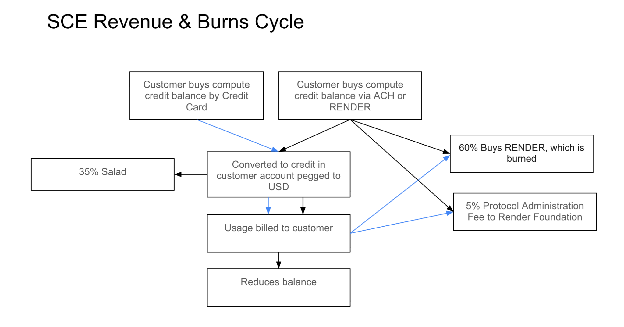
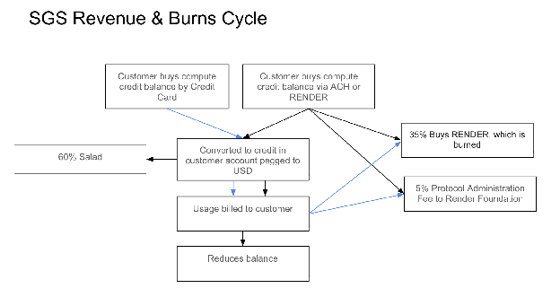
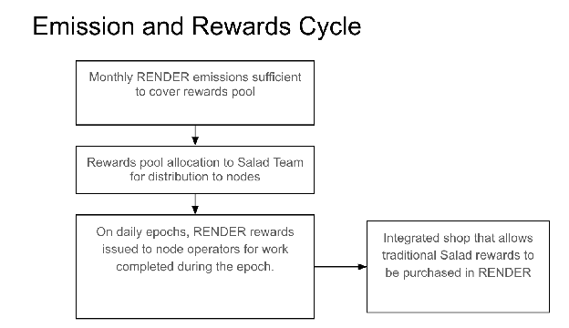
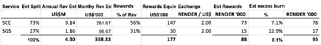

# RNP-023: Proposal for the Salad Network to migrate to RENDER

| RNP # | Title | Category | Authors | Created | Status |
| ----- | ----- | ----- | ----- | ----- | ----- |
| 023 | Proposal for the Salad Network to migrate to RENDER | Network | Salad Technologies, Render Foundation | 2026-03-26 | Draft |

# TL;DR

- Salad proposes to fully integrate with the Render Network as an exclusive subnet
- Exclusively working with the Render Network to establish a subnet
- Salad will migrate payments and rewards for distributed computing and bandwidth sharing to onchain transactions using RENDER
- Would integrate into BME, significantly expanding Network revenue, with designs to have burns exceed mints built in from the outset
- Timing differences between burns and mints have a stabilizing effect on RENDER/US$ exchange
- Brings forward RENDER emissions to support this step-change increase in Network usage, while retaining the current emissions cap, and current emissions for node rewards
- Incentives to Salad for making the integration to be funded from existing Network Operations treasury. Incentives are a combination of time based and performance based milestones.
- This proposed model is a move toward more predictable economics for node operators.

# Overview

The Salad Network (managed by Salad Technologies) ("Salad") is a distributed cloud computing network that allows PC owners to earn rewards by sharing their idle hardware resources—specifically GPU, CPU, and internet bandwidth. Organizations use this distributed "community cloud" to run high-performance workloads such as AI/ML inference, video rendering, and scientific research at a lower cost than traditional providers like AWS.

Founded in 2018, Salad's mission is to democratize cloud computing by utilizing latent consumer resources to power a sustainable, affordable, environmentally friendly cloud for everyone. Salad currently operates global infrastructure across 180+ countries and has 60,000 daily heartbeating GPUs on the network.

In mid 2025, Salad began exploring transitioning to onchain, token-based transactions with the expectation of becoming a top DePIN protocol by revenue. Rather than launching yet another token in an already crowded market, Salad began conversations with existing protocols to explore partnership opportunities. With Salad's established revenue, customer base, and production-grade network of distributed infrastructure, the potential for a mutually beneficial partnership became clear.

In early 2026, Salad began a test with Golem Network (GLM) to evaluate crypto payments and decentralised orchestration of their platform. These tests showed great potential for Salad, opening the door to find a long term partner who Salad would work with exclusively.

Salad is progressively decentralising towards a full DePIN model and is seeking approval from the Render community for end-to-end integration with the Render Network, allowing new and existing Salad customers to fund their accounts in RENDER, rewarding node operators (known as "Chefs") in RENDER and incorporating the BME model. This would be an exclusive relationship, whereby Salad only works with RENDER within the wider DePIN space.

Salad would become a third Render Network subnet, alongside Dispersed and rendernetwork.com.

The RNP proposes some notable differences compared with the flows currently used for the rendering and compute subnets. In summary:

- The related node rewards required to support the current and projected usage at commercial rates when integrating Salad exceeds the current available unallocated node rewards emitted each month. This RNP proposes solving for that by modifying the emissions schedule, without changing the overall emissions cap, by bringing forward monthly network operations emissions in order to cover Salad node rewards.
- Burns are triggered dependent on customer payment and terms (more below), while node rewards accrue as work is completed.
  - For [Salad Container Engine](https://salad.com/salad-container-engine) (SCE), this timing difference means there may be changes in the RENDER price between burn and emission, the effect being that the number of RENDER burned will increase if the price drops during the period, and decrease if the price increases during the period.
  - For [Salad Gateway Service](https://salad.com/salad-gateway-service) (SGS), where customer payment terms are NET30, the impact moves the other way around.
  - Both have a moderating impact on the on the RENDER / US$ exchange rate
- Node rewards would be calculated using the current commercial terms offered by Salad, and made in RENDER equivalent.
- The RNP also proposes a mechanism to allow burns to be higher than node rewards, assuming no price movements between burns and emissions for simplicity. This comes from burning 4% of revenue over and above the rewards made to nodes / Chefs. Examples are provided below. The Render Foundation and Salad are authorised to adjust this up or down to adapt to potential market changes over time. Changes must be agreed between Render Foundation and Salad, recorded in writing, and communicated publicly with relevant context. Any change to below 3% of revenue must be approved via the RNP process.

The Render Network would provide incentives to Salad Technologies detailed below under "Reasoning" to help facilitate this integration. The incentives are dual: the first would provide Salad the option to purchase warrants; the second would have a time-based component in return for an investment in Salad. Both components would be dependent on performance milestones.

# Reasoning

After eight years in operation, Salad's scale is reaching the point where there are meaningful savings achievable by moving away from costly centralised payment providers and usage-based billing platforms currently in use, and switching to blockchain payment rails. This is more relevant as Salad positions itself for growth. Integrating with the Render Network enables this.

Salad would integrate their centralised marketplace with RENDER, enabling both Salad's customers and suppliers ('Chefs') to make payments and receive rewards in RENDER.

Upon completion of the integration, Salad Chefs will benefit from greater flexibility: they will have their rewards balance displayed in RENDER and be able to either (a) withdraw RENDER to a self hosted wallet or (b) redeem from Salad's existing storefront using RENDER to claim a range of rewards such as gift cards, games, downloadable content, PayPal balance or digital subscriptions.

New and existing Salad customers will be able to make payments for both compute and networking products in RENDER, alongside legacy payments using fiat rails. As Salad begins realising lower Cost of Goods Sold from RENDER payments, tiered pricing may be introduced to encourage the use of RENDER for all payments.

Salad provides two main products, both of which will be fully transitioned over to RENDER's BME model:

- SCE, a managed container service, comparable to those offered by the hyperscalers, but available for a fraction the cost. This self-service product allows developers to deploy containerised workloads across thousands of replicas powered by globally distributed consumer GPU infrastructure. SCE customers range from solo devs, to AI Startups, to biotech. Workloads range from text-to-image/video, LLMs, drug discovery (molecular dynamics simulations), ZKPs, etc. SCE is workload agnostic, supporting a wide range of use cases.
- SGS, a Residential IP Proxy service allowing VPN operators to access dedicated nodes serving high-bandwidth traffic globally. This product is not self-service and requires a comprehensive KYC process for new customer onboarding. The service is restricted to a list of preapproved streaming services. SGS customers range from small VPN providers to S&amp;P 500 enterprise customers.

As demand for inference tokens continues to surge, Salad is building an LLM API slated for launch in Q2 2026. This new service will run on top of SCE, delivering a low-cost SaaS solution that supports a variety of open-source AI models. In close collaboration with The Render Network Foundation (the "Render Foundation" or the "Foundation"), Salad aims to harness idle consumer GPUs to fuel the next wave of agentic AI.

## Transitional considerations

At the time of implementation, Salad customers may have existing balances on their accounts. In order to transition to operating under the BME as proposed in the RNP, Salad will burn RENDER in a proportionate amount of customers' balances at the time of full implementation.

## High Level Flows

### Revenue and Burns

Salad would integrate its revenue into the Render Network burn-mint equilibrium model ("BME") meaning a portion of revenue would be burned. Salad would continue to manage the billing system for Salad customers.

The following revenue split will differ across Salad's two product lines:

Salad Container Engine: 35% to Salad as the network operator, 5% going to the Render Foundation, and 60% going to BME and being burned.

Salad Gateway Service: 60% to Salad as the network operator, 5% going to the Render Foundation, and 35% going to BME and being burned.

In order to maintain margin for Salad and the Salad Chefs, cover 5% to the Foundation, and enable burns to exceed Chef rewards (when RENDER price movements are factored out) by 4% of revenue, Salad may elect to increase its product pricing on full implementation as envisaged.

A note on the 5% Protocol Administration Fee for the Render Foundation: The fees generated from this structure are intended to help the Foundation begin transitioning away from relying exclusively on emissions to fund its operations and towards a more economically sustainable funding structure. Foundation operations are not expected to be fully funded by this fee in the beginning; as usage grows, so would Foundation funding from this fee.

Using previous revenues and not accounting for Salad's growth trajectory, combined revenue projections for year 1 post integration are approximately US$4.3M, with a split of 73% to SCE and 27% to SGS. These figures are illustrative only; forward revenues to be confirmed.

Depending on the customer payment type, burns would be triggered according to the following schedule:

1. Payment by RENDER: burns are implemented when Salad receives RENDER payment and credits customer account
2. Payment by credit card: burns are implemented:
   1. Each 24 hour period as customer consumes credits, or
   2. When the chargeback period has expired for unconsumed credits (typically 120 days)
3. Payment by ACH: burns are implemented when Salad receives payment. Note: SGS customers are on NET30 terms

All burns happen at the prevailing conversion rate of USD to RENDER.

In the event of a Salad customer not paying invoices, Salad will cover the cost of burning the RENDER tokens required to offset emissions for related node rewards.

Rewards to Chefs would be issued per epoch based on work performed in that epoch, which would initially be on a 24-hour cycle. As Chefs provide resources, reward balance accrues in USD and then becomes accessible to the Chef as RENDER at the end of each epoch, i.e. every 24hrs. Salad will use a 24hr TWAP taken from Jupiter DEX to price RENDER rewards.







### Rewards

Once implemented, the Render Network would fund Salad with a rewards balance of RENDER monthly in advance based on anticipated monthly volumes, adjusted for the remaining balance from the prior month. Salad is responsible for reporting usage and calculating and distributing rewards to Salad Chefs on a daily epoch cycle. These figures will be reported on the Render Foundation dashboard, currently [https://stats.renderfoundation.com/](https://stats.renderfoundation.com/).

Based on current usage volumes on Salad, and assumed RENDER pricing of US$2.00 for illustration, the initial monthly rewards are likely to be in the region of 88,000 RENDER per month, with estimated related burns of 95,000 RENDER per month (see examples below). While the RENDER price, and therefore rewards and emissions, is not easily forecastable, the mechanics imply a trend of around 8.1% more burns than rewards. See examples further below.

The examples are for illustrative purposes only. Actual monthly emissions will be determined on remaining prior-month balance as well as best estimates of future demand.

To facilitate community tracking, emissions for Chef rewards to be held in a separate escrow wallet controlled by the Foundation that will be used to fund the monthly rewards issued by Salad.

Rewards are expected to be \~56% of total revenue generated by SCE and \~31% of total revenue generated by SGS. This may change as Salad's supply:demand marketplace dynamics evolve.

### Transparency and Reporting

In order to facilitate transparency and traceability, Salad will place all necessary deposit, job and rewards data onchain. The Render Foundation will set up two dedicated burn wallets, one for SCE and one for SGS transactions.

Salad will maintain a public stats dashboard with a corresponding public API. The stats dashboard and API will allow users and the community to view detailed subnet metrics and to easily correlate offchain activities with their corresponding onchain transactions. The stats API will have reasonable API limits applied to protect the availability and uptime of the service. Additionally, Salad will publish monthly reconciliation reports that provide aggregate data broken down by key characteristics, such as payments made via fiat versus RENDER tokens and rewards paid by product line.

Given the margins for SCE and SGS are the aggregate margin for each product, an accounting will be kept of the burn based on the aggregate margin vs the actual margin of job performed. If actual work exceeds burns in aggregate, Salad will perform a "top-up" burn to bring burns in line. These transactions will be displayed on a dashboard provided by Salad.

## Changes to emissions schedule

The emissions schedule as adopted by [RNP-001](https://github.com/rendernetwork/RNPs/blob/main/RNP-001.md) has fixed annual emissions and an ultimate emissions cap, which would be reached approximately 57 years from now, in BME year 60. Current pace of network operations emissions is insufficient to cover node rewards for the Render Network and Dispersed, as well as Chef rewards in periods of rapid growth, as would be the case if Salad or a similar project is onboarded.

This RNP proposes bringing a portion of those emissions forward to accommodate the additional rewards needed for Salad Chefs based on current and anticipated Network growth should the Salad integration be approved. The RNP does this while retaining the current overall emissions cap.

The amount of emissions pulled forward would not be a permanent, fixed figure. The figure would be adjusted monthly. Examples provided throughout this proposal are for illustrative purposes. Actual emissions would vary monthly based on prior month balance and future, demand-based projections.

We note for reference that, should the emissions cap be reached far sooner than the current plan, there is already a mechanism in [RNP-001](https://github.com/rndr-network/RNPs/blob/main/RNP-001.md#:~:text=A%20net%20emissions,and%20mint%20equilibrium.) which retains the emissions cap, while allowing flexibility to mint previously burned RENDER:

"A net emissions cap would be designed to ensure that once the supply cap for the base token has been reached by the network, fulfillers are still able to receive rewards for performing work on the network

1. On an epoch by epoch basis, net emissions would "recycle" (i.e. mint) some set of burned base tokens available for use in rewarding fulfillers when there are no longer enough provided through minting.
2. Net emissions allow rewards to exist in later years, while also not extinguishing deflationary pressure after the cap has been reached. However, they need to be capped at some percentage of current issuance to maintain the core burn and mint equilibrium."

Illustrative changes to monthly emissions:

| | Current (BME year 3) | Proposed |
| :---- | ----- | ----- |
| Artist and AI grants | 123,033 | 123,033 |
| Node rewards | 123,033 | 123,033 |
| Operations, R&amp;D, and growth | 246,066 | 246,066 |
| Salad Chefs rewards (estimated) | 0 | 88,240 |
| **Total** | **492,132** | **580,372** |

Illustrative monthly burns (factoring out RENDER / US$ movements) related to Salad, using current SCE and SGS revenue proportions:

| | Without Salad RENDER | With Salad RENDER |
| :---- | ----- | ----- |
| Salad Chefs rewards (estimated) | 0 | 88,240 |
| Illustrative relative burns @8.1% differential from rewards | 0 | \-95,374 |
| **Illustrative net burns** | **0** | **-7,135** |

Workings here - the estimated rewards to burn differential percentages are pulled from the examples below (Scenario 1 in each case that has consistent pricing for burns and rewards) where SCE would yield \~7.1% and SGS would yield \~12.9% more burn than rewards, factoring out price movements:



## Examples

### SCE customer

$1,000 added to Salad account by customer
Burns at 60% = US$600
RENDER at US$2.00 = 300 RENDER BURNED

Assume for sake of example US$1,000 in compute is provided to the customer and the applicable reward to Chefs is 56% of customer spend (60% less 4% burn coming from gross margin).

Scenario 1: If RENDER price stays constant at US$2.00 at time work is measured, then $560 / 2.00 = 280 RENDER in job rewards to Chefs.

The related net burn is 20 RENDER (300 burned less 280 rewards) or 7.1% (20/280) larger than emissions.

Scenario 2: If RENDER price increases between burn and emissions, e.g. RENDER moves to US$2.10 at time work is measured, then $560 / 2.10 = 266.7 RENDER in job rewards to Chefs.

The related net burn is 33.3 RENDER (300 burned less 266.7 rewards) or 12.5% (33.3/266.7) larger than emissions.

Scenario 3: RENDER price decreases between burn and emissions, e.g. RENDER moves to US$1.90 at time work is measured, then $560 / 1.90 = 294.74 RENDER in job rewards to Chefs.

The related net burn is 5.26 RENDER (300 burned less 294,74 rewards) or 1.8% (5.26/294.74) larger than emissions.

### SGS customer

$1,000 added to account by customer
Burns at 35% = US$350
RENDER at US$2.00 = 175 RENDER BURNED

Assume for sake of example US$1,000 in bandwidth is used on a job and the applicable reward to Chefs is 31% of customer spend (35% less 4% burn coming from gross margin).

Scenario 1: If RENDER price stays constant at US$2.00 at time work is measured, then $310 / 2.00 = 155 RENDER in job rewards to Chefs.

The related net burn is 20 RENDER (175 burned less 155 rewards) or 12.9% (20/155) larger than emissions.

Scenario 2: If RENDER price increases between burn and emissions, e.g. RENDER moves to US$2.10 at time work is measured, then $310 / 2.10 = 147.62 RENDER in job rewards to Chefs.

The related net burn is 27.38 RENDER (175 burned less 147.62 rewards) or 18.5% (27.38/147.62) larger than emissions.

Scenario 3: RENDER price decreases between burn and emissions, e.g. RENDER moves to US$1.90 at time work is measured, then $310 / 1.90 = 163.16 RENDER in job rewards to Chefs.

The related net burn is 11.84 RENDER (175 burned less 163.16 rewards) or 7.3% (11.84/163.16) larger than emissions.

## Incentives

The Render Network would provide the following incentives to Salad technologies to help facilitate this integration:

1. Render Network to grant Salad a warrant to purchase 1M RENDER at the current price (30 day trailing TWAP) on deal signature and announcement of Salad exclusively joining the Render Network following a successful final vote. This warrant has the following conditions:
   1. Warrants to have a 2 year term from issuance date.
   2. Warrants to vest as follows:
      1. 5% on deal signature and confirmation of Salad exclusively joining the Render Network
      2. 5% upon public launch of functionality for Salad Chefs to take rewards in RENDER, provided this is implemented no later than 90 days post issuance. The Render Foundation may, at its discretion, provide a premium incentive for Salad Chefs electing to receive rewards in RENDER (e.g. 105% of their Chef balance). Any such incentive must be separately funded by the Render Network. This does not preclude Salad from running its own incentives.
      3. 5% upon public launch of functionality facilitating customers depositing RENDER as payment, provided this is implemented no later than 180 days post issuance. The Render Foundation may, at its discretion, provide a payment incentive for customers using RENDER (e.g. every $1 in RENDER tendered could result in 1.05 $SALAD available in their Salad customer account). Any such incentive must be separately funded by the Render Network. This does not preclude Salad from running its own incentives.
      4. 35% upon public launch of Salad using RENDER and the BME mechanism described within this RNP, provided that this is done no later than 1 year post warrants issuance / deal signature.
      5. 50% vests monthly over 12 months after the public launch of Salad using RENDER and the BME mechanism (point 1. b. iv. above). Monthly vesting is triggered upon hitting  more than $150k/mo revenue through the subnet in that calendar month. Put differently, if any month the revenue metric is not achieved, no warrants will vest related to that month. Each month will be assessed on a standalone basis.
   3. The Render Foundation can determine whether vested warrants are exercised on a net basis.

2. A US$1M SAFE for the Render Foundation to hold on behalf of the Render Network, payable to Salad in RENDER on a monthly basis at the start of each month (US$166.67k pm). Monthly payment to be determined by a 30-day trailing TWAP. Provided however payments cease should any of the milestones in part 1 not be achieved within the timeframe specified. Investment tranches to start upon full execution of agreement. Using a SAFE provides Salad with a cash injection and the Render Network receives an convertible equity interest in Salad in exchange. The SAFE will be a standard NVCA document with a side letter accommodating monthly tranches. The terms on this SAFE will be:
   1. A US$90M valuation cap
   2. A 20% discount

These incentives would be funded from reserves in the Network Operations allocation of RENDER rather than 2026 emissions. These incentives are for the integration and are not related to Chef rewards.

# Stakeholders Impacted

This is for all members of the Render Network community.

# Implementation Plan

Salad will be responsible for the development and implementation of three milestones.

**Milestone 1: RENDER rewards for Salad Chefs**

Max Timeline: 90 days

Salad would integrate an additional option within the existing Salad rewards [storefront](https://salad.com/store) allowing Chefs to receive their 'Salad Balance' as RENDER tokens.

Within the storefront, Chefs will be provided with a means to enter a Solana Wallet address where RENDER tokens are to be deposited. The Chef can select an amount of RENDER to redeem from their Salad Balance, and a quote based on the current token price will be generated. As the Chef makes a RENDER redemption, their Salad Balance will be deducted and RENDER will be sent to their wallet address within 24hrs.

At the discretion of the Render Foundation, a 5% bonus for redeeming RENDER may be applied.

This workflow will be superseded by Milestone 3, upon which Salad Balance is replaced by RENDER as the denominator within Salad's storefront.

**Milestone 2: RENDER payments by Salad's Customers**

Max Timeline: 180 days

Salad would incorporate an additional payment flow within the SCE [deployment portal](https://portal.salad.com/) allowing customers to deposit RENDER to credit their account.

Customers will be provided with a deposit address. Upon receiving RENDER, Salad will credit the account with USD using spot pricing provided by [Jupiter](https://jup.ag/). New accounts funded by RENDER will have quota limits in line with Salad's existing system. Customers seeking more than 10 replicas (GPUs) can contact Salad support to undergo KYC for a quota increase.

At the discretion of the Render Foundation, a 5% bonus for paying with RENDER may be applied.

**Milestone 3: Using RENDER as Salad's Payment Rails**

Max Timeline: 365 days

Salad would migrate all existing SCE and SGS transactions over to RENDER, incorporating BME as described above.

Salad Chefs will have their rewards balance displayed in RENDER, and can either (a) withdraw RENDER to a Solana wallet or (b) redeem storefront rewards using RENDER.

Chefs contributing to the network will accrue RENDER every epoch with these rewards kept in a wallet managed by Salad, allowing for onchain visibility into all resources provided by Chefs to SGS and SCE. Salad will be the custodian for this reward wallet, and Chefs can elect to withdraw and self custody by providing a withdrawal address. Alternatively, Chefs can elect to receive daily epoch RENDER rewards directly to their self custody wallet automatically.

Salad Customers will be able to load credits onto their account with either (a) RENDER or (b) fiat payments. Salad will send RENDER to three wallets according to the schedule described above:

- Render Network Foundation wallet
- Burn wallet
- Salad's wallet

Salad will develop and maintain a dashboard displaying all transactions and burns.

# Technical Considerations

The Salad team will handle the integration development. This RNP integrates Salad's existing compute marketplace into the Render Network. There are few direct technical considerations for the Render Network. The Render Foundation will set up two dedicated burn wallets for Salad-related burns, one related to SCE and one related to SGS.

Salad's existing Chef storefront will need to be extended to show dynamic prices in RENDER with consideration of existing agreements with storefront suppliers (e.g. region restrictions, minimum prices). Current Salad Chef balance tracking and reporting will similarly be extended to track and display Chef balances in Render. Salad's existing customer payment structures, including crypto payments will be extended to RENDER payments. The full payment rail integration in Milestone 3 will require larger migrations undertaken by Salad, to their existing payment and rewards system. The technical details of the BME payment rail migration are described in the Implementation Plan. The longer timeline for Milestone 3 reflects this difference in scope.

Additionally, this integration includes implementing information APIs for the Render Foundation. These APIs will provide daily customer deposit totals and revenue / usage figures that can be reported on the Render Foundation dashboard, (currently [https://stats.renderfoundation.com/](https://stats.renderfoundation.com/)) to facilitate monitoring burns and rewards. See appendix for a suggested API design. Salad will supplement the suggested API design with additional metadata to allow users and the community to easily correlate offchain activities with their corresponding onchain transactions.

# Potential Drawbacks

Perceived competition with [Dispersed](https://dispersed.com). The Render Network's primary role is as a two-sided marketplace - matching a supply of idle compute with demand at competitive pricing and has relationships with several compute partners. Adding an additional network enhances this position and aligns with BME.

# Appendix — API Specification

***Base URL***: TBD by Salad

***Auth***: TBD (API key header recommended, e.g. X-API-Key)

***Timestamps***: UTC, ISO 8601 format (YYYY-MM-DDTHH:mm:ssZ)

***Dates***: YYYY-MM-DD (UTC)

***RENDER amounts***: String-encoded integers in smallest units (1 RENDER = 100,000,000 units, 8 decimals). Use strings to avoid floating-point precision loss.
***USD amounts***: String-encoded integers in cents, or string-encoded decimals with 2 decimal places — Salad to confirm preferred approach.

***Pagination***: Cursor-based. Responses include a "cursor" field; pass it as ?cursor= to get the next page. Omit for the first page.

***Rate limits***: TBD by Salad

**TOKEN REFERENCE**
***RENDER*** — *rndrizKT3MK1iimdxRdWabcF7Zg7AR5T4nud4EkHBof* — 8 decimals
***USDC*** — *EPjFWdd5AufqSSqeM2qN1xzybapC8G4wEGGkZwyTDt1v* — 6 decimals

**ENDPOINTS**

**1. Account Deposits**

Returns individual customer account top-ups. Salad handles the associated burns. Deposits may not be considered final until the chargeback window has passed.

**GET** ***/deposits***

**Query Parameters:**
  ***from*** (datetime, required) — Start of time range (inclusive)
  ***to*** (datetime, required) — End of time range (exclusive)
  ***cursor*** (string, optional) — Pagination cursor
  ***limit*** (integer, optional) — Page size (default 100, max 1000)

***Example Response:***

```json
{
  "data": [
    {
      "depositId": "string",
      "userId": "string",
      "renderAmount": "string",
      "status": "string",
      "depositedAt": "2026-03-18T12:00:00Z"
    }
  ],
  "cursor": "string or null",
  "hasMore": true
}
```

**Field Definitions:**
  ***depositId*** (string) — Unique deposit identifier
  ***userId*** (string) — User/account identifier (must be consistent across calls so Render can track per-user activity)
  ***renderAmount*** (string) — RENDER deposited, in smallest units (8 decimals)
  ***status*** (string) — Deposit status, e.g. *"pending"* (within chargeback window), *"confirmed"* (chargeback window passed), *"reversed"* (charged back)
  ***depositedAt*** (datetime) — When the deposit occurred

**2. Job-Level Completions**
Returns individual completed jobs. Feeds the buy & burn pipeline.

**GET** ***/jobs/completed***

**Query Parameters:**
  ***from*** (datetime, required) — Start of time range (inclusive)
  ***to*** (datetime, required) — End of time range (exclusive)
  ***cursor*** (string, optional) — Pagination cursor
  ***limit*** (integer, optional) — Page size (default 100, max 1000)

***Example Response:***

```json
{
  "data": [
    {
      "jobId": "string",
      "userId": "string",
      "renderUsed": "string",
      "completedAt": "2026-03-18T12:00:00Z"
    }
  ],
  "cursor": "string or null",
  "hasMore": true
}
```

**Field Definitions:**
  ***jobId*** (string) — Unique job identifier
  ***userId*** (string) — User/account identifier (must be consistent across calls so Render can track per-user spend)
  ***renderUsed*** (string) — RENDER consumed by this job, in smallest units (8 decimals)
  ***completedAt*** (datetime) — When the job finished

**3. Daily Summary**
Aggregated daily totals for dashboard display.

**GET** ***/stats/daily***
**Query Parameters:**
  ***from*** (date, required) — Start date (inclusive)
  ***to*** (date, required) — End date (inclusive)

***Example Response:***

```json
{
  "data": [
    {
      "date": "2026-03-18",
      "totalRenderDeposited": "string",
      "totalRenderBurned": "string",
      "totalRenderUsed": "string",
      "totalUsdRevenue": "string",
      "uniqueDepositingUsers": 0,
      "uniqueActiveUsers": 0,
      "depositCount": 0,
      "burnCount": 0,
      "jobCount": 0
    }
  ]
}
```

**Field Definitions:**
  ***date*** (date) — The UTC date
  ***totalRenderDeposited*** (string) — Sum of all account top-ups that day, in smallest units
  ***totalRenderBurned*** (string) — Sum of all RENDER burned by Salad that day, in smallest units
  ***totalRenderUsed*** (string) — Sum of all RENDER consumed by completed jobs that day, in smallest units
  ***totalUsdRevenue*** (string) — USD revenue generated that day
  ***uniqueDepositingUsers*** (integer) — Distinct users who made deposits that day
  ***uniqueActiveUsers*** (integer) — Distinct users who completed jobs that day
  ***depositCount*** (integer) — Total deposits that day
  ***burnCount*** (integer) — Total burns executed that day
  ***jobCount*** (integer) — Total jobs completed that day

**4. User-Level Summary**
Per-user aggregated data over a date range. Used for grant tracking and per-user burn allocation.

**GET** ***/stats/users***
**Query Parameters:**
  ***from*** (date, required) — Start date (inclusive)
  ***to*** (date, required) — End date (inclusive)
  ***userId*** (string, optional) — Filter to a specific user. If omitted, returns all users with activity in the range.
  ***cursor*** (string, optional) — Pagination cursor
  ***limit*** (integer, optional) — Page size (default 100, max 1000)

***Example Response:***

```json
{
  "data": [
    {
      "userId": "string",
      "totalRenderDeposited": "string",
      "totalRenderSpent": "string",
      "depositCount": 0,
      "jobCount": 0,
      "firstActivityAt": "2026-03-01T08:00:00Z",
      "lastActivityAt": "2026-03-18T14:30:00Z"
    }
  ],
  "cursor": "string or null",
  "hasMore": true
}
```

**Field Definitions:**
  ***userId*** (string) — User/account identifier
  ***totalRenderDeposited*** (string) — Total RENDER deposited by this user in the date range, in smallest units
  ***totalRenderSpent*** (string) — Total RENDER consumed by this user in the date range, in smallest units
  ***depositCount*** (integer) — Number of deposits made by this user
  ***jobCount*** (integer) — Number of jobs completed by this user
  ***firstJobAt*** (datetime) — Earliest job completion in the range
  ***lastJobAt*** (datetime) — Latest job completion in the range

**5. Burns**

Returns burn transactions executed by Salad. Used by Render to display burn data on the dashboard (totals, burn-to-mint ratios, burn history).

**GET** ***/burns***

**Query Parameters:**
  ***from*** (datetime, required) — Start of time range (inclusive)
  ***to*** (datetime, required) — End of time range (exclusive)
  ***cursor*** (string, optional) — Pagination cursor
  ***limit*** (integer, optional) — Page size (default 100, max 1000)

***Example Response:***

```json
{
  "data": [
    {
      "burnId": "string",
      "renderBurned": "string",
      "txSignature": "string",
      "burnedAt": "2026-03-18T12:00:00Z"
    }
  ],
  "cursor": "string or null",
  "hasMore": true
}
```

**Field Definitions:**
  ***burnId*** (string) — Unique burn identifier
  ***renderBurned*** (string) — RENDER burned, in smallest units (8 decimals)
  ***txSignature*** (string) — Solana transaction signature (on-chain proof)
  ***burnedAt*** (datetime) — When the burn was executed

***DATA FRESHNESS***
Render's dashboard polls via cron jobs, not real-time.
Daily summary can lag by up to 24 hours, but job-level data should be near-current (within a few hours of completion).
